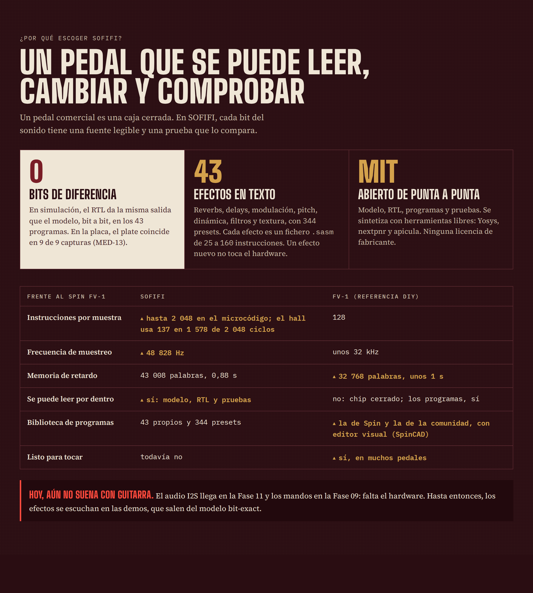

<!-- i18n: fuente=README.md sha=b581423fa49d estado=al_dia -->
# SOFIFI — Soundscapes On FPGA: Integrated Filters & Impulses

*In Spanish: Sintetizador de Ondas y Filtros Inmersivos en FPGA Integrada.*

**Languages:** [Español](README.md) (source) · English · [简体中文](README.zh-CN.md)


*The images are in Spanish, the source language of the project.*

SOFIFI is an ambient guitar pedal (reverbs, shimmer, tape delays, freeze, granular)
implemented on a **Sipeed Tang Primer 25K** FPGA (Gowin GW5A-LV25).

**Version:** `0.6` (the version is the last closed phase; see `docs/fases/estado_fases.csv`).

> Status: **a library of 43 programs and 344 presets** (Phase 06): reverbs,
> delays, modulation, pitch, dynamics, filters and texture. All 43 give in the
> RTL the same output as the bit-exact model (simulation). On the board, at
> 100 MHz, the plate is verified (Phase 05). Next: the micro-looper and the
> granular engine (Phase 07). It does not play with a guitar yet: the audio
> codec is missing (Phase 11).

## Listening to the effects (no hardware needed)

1. Listen to the demos in `demo_examples/`: a synthetic guitar (an Em9
   arpeggio) through each program, in Ogg Vorbis.
2. Process your own WAV with a preset:

```bash
.venv/bin/sofifi presets hall                      # the presets of one program
.venv/bin/sofifi render programas/hall.sasm guitar.wav out/hall.wav --preset "Catedral" --cola 6
.venv/bin/sofifi render programas/shimmer.sasm guitar.wav out/sh.wav --pot pot0=0.7 --pot pot3=0.6 --cola 6
.venv/bin/sofifi render programas/freeze.sasm guitar.wav out/fz.wav --preset "Congelar suave" --freeze 1.5:8 --cola 8
```

| Family | Programs |
|---|---|
| Reverb | plate, plate_vivo, hall, blackhole, cloud, bloom, spring, chorale, resonador, gated, reverb_inversa, infinite, freeze, freeze_givens, shimmer, shimmer_quinta, shimmer_energia |
| Delay | delay, cinta, bbd, pingpong, lluvia, ducking, reverse |
| Modulation | chorus, flanger, phaser, tremolo, vibrato, slicer |
| Pitch | octava, armonizador, doblador, escalera |
| Dynamics | compresor, puerta, swell |
| Filter | autowah, filtro, ancho |
| Texture | saturacion, lofi, ringmod |

What each program does, its knobs and its cost: `docs/programas.md` (Spanish;
`sofifi catalogo` generates it). The presets are in `presets/banco.toml`; their
names are in Spanish.

The input WAV may be 16, 24 or 32-bit at any sample rate; it is resampled to
48,828 Hz. `sofifi asm` generates the microcode (`.hex` + `.json`) and gives the
cycles it uses in the RTL. (`--cola` is the tail length in seconds.)

## What will be built

- **A microcoded DSP core** in the style of the Spin FV-1, extended: 2,048
  instructions per sample, 48-bit accumulator and cubic interpolation (ADR 0006).
  Effects are *programs*, not RTL modules.
- **All audio in BSRAM** (about 0.9–1.4 s of delay lines). The microSD stores
  presets and recordings, but it cannot be used as delay memory (ADR 0004).
- **fs = 48,828 Hz**, with a 100 MHz system clock: exactly 2,048 cycles per sample
  (ADR 0005).
- **A bit-exact reference model in Python**, which is the oracle the RTL is
  validated against (ADR 0003).



The 2026 state of the art and the roadmap are in
`docs/investigacion/ESTADO_DEL_ARTE_2026.md` (Spanish). The full infographics are
in `docs/infografias/`.

## Getting started

```bash
make install    # creates .venv with the model and gate tooling
make hooks      # installs the versioned pre-push hook
make ci         # full local gate
```

The working discipline is in `docs/SPEC_RAIZ.md`; the cold-start map is in
`AGENTS.md` (both in Spanish).

### EDA toolchain (Phase 02)

`make install` installs the whole open toolchain through pip: Yosys and
nextpnr-himbaechel-gowin (YoWASP), apicula, openFPGALoader, verilator and cocotb.

```bash
make sim        # cocotb testbenches for the RTL
make prog       # synthesizes hola_uart and loads it into the Tang Primer 25K SRAM
make uart       # reads the debugger UART (/dev/ttyUSB1) and requires "SOFIFI"
```

Programming without sudo needs the udev rule for the BL616 debugger
(`0403:6010`, group `plugdev`); install it once following
`scripts/udev/99-tang-primer-25k.rules`.

### Optional tools (soft gates)

- `shellcheck`: script lint.

If a tool is missing, the gate says so (`WARN … NO CORRIÓ`); it does not fake a green.

## Hardware

| Part | Status |
|---|---|
| Tang Primer 25K + Dock | available |
| 64 GB microSD (PMOD TF) | available |
| I2S codec (PCM1808 + PCM5102A or Digilent Pmod I2S2) | **missing** (Phase 11) |
| MCP3208 + potentiometers | missing (Phase 09; the Dock buttons act as footswitches) |
| 128×64 SSD1306 OLED | missing (Phase 10) |
| Guitar input buffer | missing (temporary: any buffered pedal) |
| Sipeed SDRAM module | future (enables long looper and granular) |

Phases that need missing hardware are at the end of the plan (09 to 12), so up
to Phase 08 the board and the microSD are enough.


## Hardware documentation (Spanish)

- `BOM.md`: hardware shopping list, with links.
- `SBOM.md`: what each FPGA component does and the tools used to build it.
- `docs/arquitectura_fpga.md`: the FPGA architecture and how it changes phase by phase.
- `fails.md`: the failures found and how they were solved.
- `schematics/`: a PDF schematic of each RTL module, generated from the Verilog.

## Languages

Spanish is the canonical source. Translations carry a seal with the fingerprint
of the version they translate, and `scripts/check_i18n.py` prevents a translation
from claiming to be up to date when it is not (ADR 0007). ADRs, phase specs and
agent maps are only in Spanish.

## License

MIT (see `LICENSE`). Only third-party code with a permissive license is ported,
and every origin is declared in `docs/terceros.yaml` (ADR 0002).
