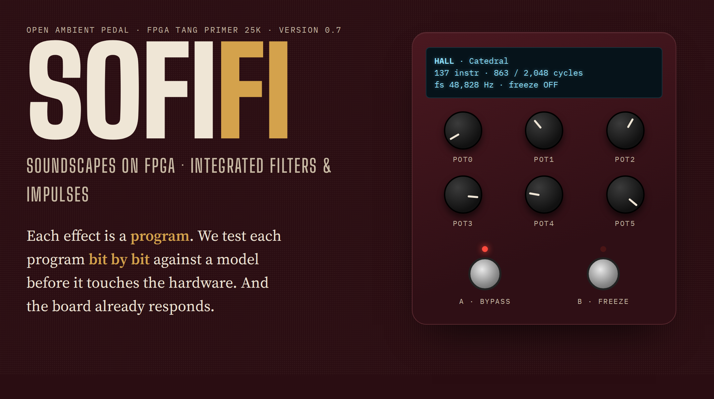
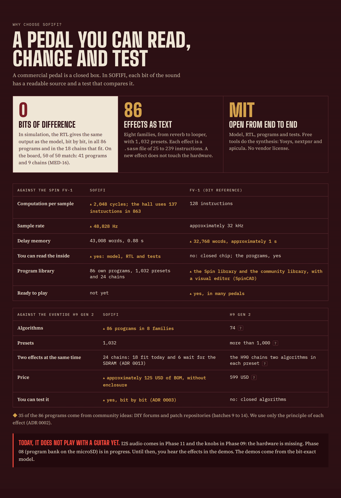
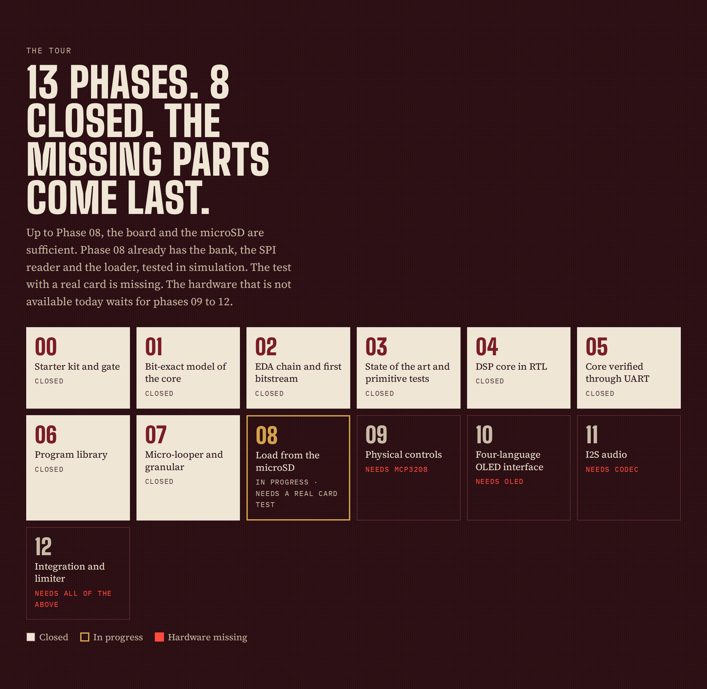

<!-- i18n: fuente=README.md sha=f59dff3484d0 estado=al_dia -->
# SOFIFI — Soundscapes On FPGA: Integrated Filters & Impulses

*In Spanish: Sintetizador de Ondas y Filtros Inmersivos en FPGA Integrada.*

**Languages:** [Español](README.md) (source) · English · [简体中文](README.zh-CN.md) · [日本語](README.ja.md)



SOFIFI is an open-source ambient guitar pedal. It runs on a **Sipeed Tang
Primer 25K** FPGA (Gowin GW5A-LV25). Each effect is a text program that a
custom DSP core executes.

**Version:** `0.7` (the version is the last closed phase; see `docs/fases/estado_fases.csv`).

## Status

| Item | Status |
|---|---|
| Library | **86 programs and 688 presets** in 8 families (Phase 07) |
| Two effects at the same time | **24 chains**: 18 fit today and 6 wait for the SDRAM (`presets/cadenas.toml`, ADR 0013) |
| Match with the model | all 86 programs and the 18 chains that fit give in the RTL the same bits as the model (simulation) |
| Board | the plate and the looper give on the silicon the same bits as the model, from 100 to 125 MHz (Phase 07) |
| Next | program load from the microSD (Phase 08) |
| Audio with a guitar | **not yet**: the I2S codec is missing (Phase 11) |

## Listen to the effects without hardware

1. Listen to the demos in `demo_examples/`. They are a synthetic guitar (an
   Em9 arpeggio) through each program, in Ogg Vorbis.
2. Process your own WAV with a preset:

```bash
.venv/bin/sofifi presets hall                      # lists the presets of one program
.venv/bin/sofifi render programas/hall.sasm guitar.wav out/hall.wav --preset "Catedral" --cola 6
.venv/bin/sofifi render programas/shimmer.sasm guitar.wav out/sh.wav --pot pot0=0.7 --pot pot3=0.6 --cola 6
.venv/bin/sofifi render programas/freeze.sasm guitar.wav out/fz.wav --preset "Congelar suave" --freeze 1.5:8 --cola 8
```

- `--preset` takes the knob values from `presets/banco.toml`. A later `--pot` changes one of them.
- `--freeze START:END` holds the footswitch between two times, in seconds.
- `--cola` adds seconds of silence at the end, so that you hear the tail.
- The input WAV can be 16, 24 or 32-bit, at any sample rate. The model
  resamples it to 48,828 Hz.

| Family | Programs |
|---|---|
| Reverb | plate, plate_vivo, hall, blackhole, cloud, bloom, spring, chorale, resonador, gated, reverb_inversa, infinite, freeze, freeze_givens, shimmer, shimmer_quinta, shimmer_energia |
| Delay | delay, cinta, bbd, pingpong, lluvia, ducking, reverse |
| Modulation | chorus, flanger, phaser, tremolo, vibrato, slicer |
| Pitch | octava, armonizador, doblador, escalera |
| Dynamics | compresor, puerta, swell |
| Filter | autowah, filtro, ancho |
| Texture | saturacion, lofi, ringmod, granular |
| Looper | looper |

`docs/programas.en.md` tells what each program does, which knobs it has and
what it costs. `sofifi catalogo` generates it. The program and preset names
are in Spanish.

## How it works

- **Microcoded DSP core**, in the style of the Spin FV-1 and extended: up to
  2,048 instructions per sample, a 48-bit accumulator and cubic interpolation
  (ADR 0006). A new effect is a `.sasm` file; the RTL does not change.
- **All the audio in the FPGA BSRAM:** 43,008 words, approximately 0.88 s. The
  microSD card keeps presets and recordings. It cannot be the delay memory,
  because its write peaks are up to 250 ms (ADR 0004).
- **Looper and granular:** a region of 32,768 words (0.67 s) with absolute
  addresses. The circular pointer does not move it. `RDAA` and `WRAA` read and
  write it (ADR 0009). The SDRAM will give longer loops.
- **fs = 48,828 Hz:** a 100 MHz clock gives exactly 2,048 cycles per sample (ADR 0005).
- **Bit-exact reference model in Python.** The RTL must give the same bits as
  the model, sample by sample (ADR 0003).
- **Real cost:** each instruction uses 2 to 50 cycles in the RTL. An
  instruction that reads the ACC waits for the result of the previous one
  (ADR 0014, Spanish). `sofifi asm` gives the cycles of a program.



The full infographics are in `docs/infografias/`. The 2026 state of the art and
the roadmap are in `docs/investigacion/ESTADO_DEL_ARTE_2026.md` (Spanish).

## Getting started

1. Create the environment with the tools for the model, the gate and the FPGA:
   `make install`.
2. Install the pre-push hook of the repository: `make hooks`.
3. Run the full local gate: `make ci`.

`docs/SPEC_RAIZ.md` defines the work discipline. `AGENTS.md` is the map to
resume the project from zero. Both are in Spanish.

### EDA toolchain

`make install` installs with pip the full open toolchain: Yosys and
nextpnr-himbaechel-gowin (YoWASP), apicula, openFPGALoader, verilator and cocotb.

```bash
make sim           # cocotb testbenches of the RTL
make prog          # synthesizes hola_uart and loads it into the SRAM of the Tang Primer 25K
make uart          # reads the debugger UART (/dev/ttyUSB1) and requires "SOFIFI"
make esquematicos  # generates again the PDF schematics of the RTL
```

To program the board without sudo, you need the udev rule of the BL616
debugger (`0403:6010`, group `plugdev`). Install it one time, with the
instructions in `scripts/udev/99-tang-primer-25k.rules`.

### Optional tools

| Tool | Use |
|---|---|
| `shellcheck` | lint of the scripts (soft gate) |
| Node.js and chrome-headless-shell | schematics (`make esquematicos`) and infographic captures |

If a tool is missing, the gate says it (`NO CORRIÓ`, "did not run"). It does not give a false green.

## Hardware

| Part | Status |
|---|---|
| Tang Primer 25K + Dock | available |
| 64 GB microSD card (PMOD TF) | available |
| I2S codec (PCM1808 + PCM5102A or Digilent Pmod I2S2) | **missing** (Phase 11) |
| MCP3208 + potentiometers | missing (Phase 09; the Dock buttons are the footswitches) |
| 128×64 SSD1306 OLED | missing (Phase 10) |
| Guitar input buffer | missing (temporary: any pedal with a buffer) |
| Sipeed SDRAM module | future (for a long looper and a long granular engine) |

The phases that need missing hardware come last (09 to 12). Up to Phase 08,
the board and the microSD card are sufficient.



## Documentation

| Document | Contents |
|---|---|
| `docs/programas.en.md` | the 86 programs: what they do, knobs, presets and cost |
| `presets/banco.toml` | the 688 presets |
| `docs/arquitectura_fpga.en.md` | the FPGA architecture and how it changes in each phase |
| `schematics/` | a PDF schematic of each RTL module, generated from the Verilog |
| `docs/EXTENDING.en.md` | how to add an effect, an instruction, an RTL module or a gate |
| `BOM.en.md` | hardware shopping list, with links |
| `SBOM.en.md` | what each FPGA component does and which tools build it |
| `fails.en.md` | the failures found: symptom, cause, resolution and lesson |

## Languages

- Spanish is the source.
- The public and technical documentation has translations into English,
  Simplified Chinese and Japanese: this README, the infographics, the catalog,
  the demo and schematic guides, the architecture, `EXTENDING`, `BOM`, `SBOM`
  and `fails`.
- Each translation has a stamp with the fingerprint of the version that it
  translates. `scripts/check_i18n.py` stops a translation that says it is up to
  date when it is not (ADR 0007).
- The ADRs, the phase specs, the research and the maps for agents are in Spanish only.

## License

MIT (see `LICENSE`). Third-party code is ported only if it has a permissive
license, and each source is declared in `docs/terceros.yaml` (ADR 0002).
