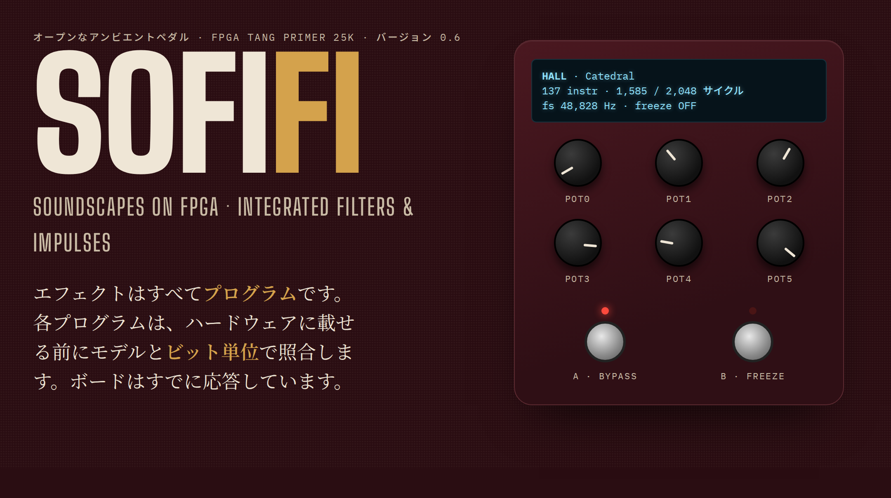
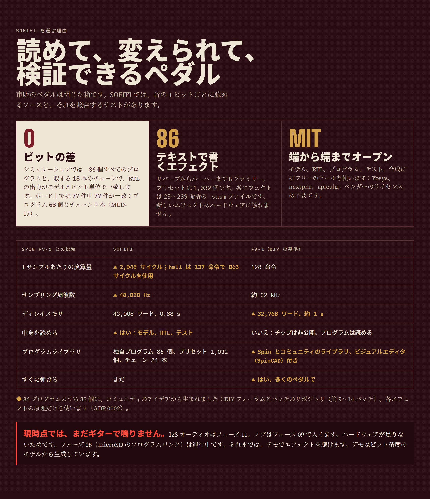
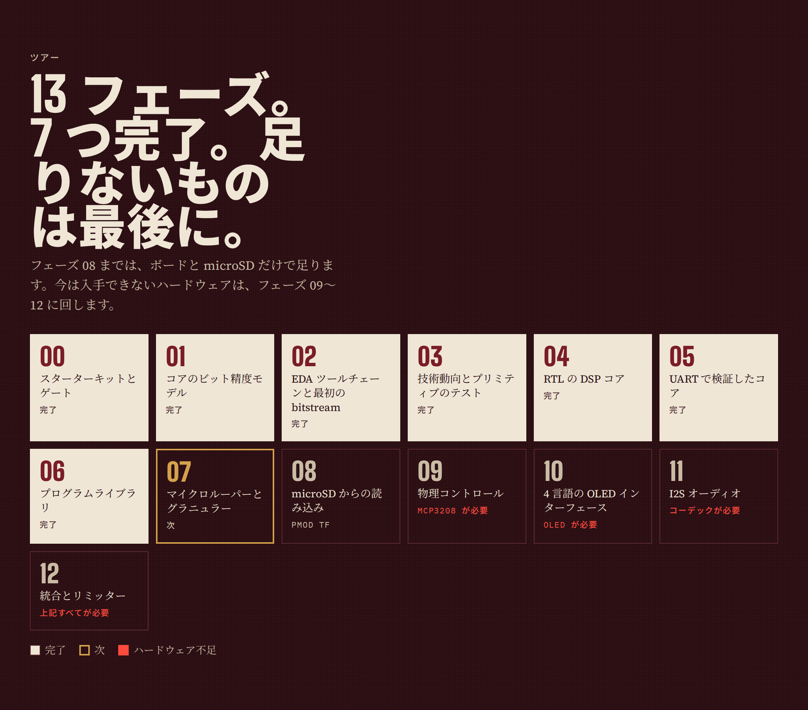

<!-- i18n: fuente=README.md sha=47259b28233f estado=al_dia -->
# SOFIFI — FPGA 上のイマーシブな波形とフィルターのシンセサイザー

*英語名: Soundscapes On FPGA: Integrated Filters & Impulses。スペイン語名: Sintetizador de Ondas y Filtros Inmersivos en FPGA Integrada。*

**言語:** [Español](README.md)（原文） · [English](README.en.md) · [简体中文](README.zh-CN.md) · 日本語



SOFIFI はオープンソースのアンビエント・ギター・ペダルです。**Sipeed Tang Primer 25K**
FPGA（Gowin GW5A-LV25）で動作します。各エフェクトはテキストのプログラムで、独自の
DSP コアが実行します。

**バージョン:** `0.7`（バージョンは最後に完了したフェーズです。`docs/fases/estado_fases.csv` を参照）。

## 状況

| 項目 | 状況 |
|---|---|
| ライブラリ | 8 つのファミリーに **69 のプログラムと 552 のプリセット**（フェーズ 07） |
| 2 つのエフェクトを同時に | **24 のチェーン**：18 は現在収まり、6 は SDRAM 待ち（`presets/cadenas.toml`、ADR 0013） |
| モデルとの一致 | 69 のプログラムすべてと収まる 18 のチェーンが、RTL でモデルと同じビットを出力（シミュレーション） |
| ボード | plate と looper はシリコン上の 100〜125 MHz でモデルと同じビットを出力（フェーズ 07） |
| 次の作業 | microSD からのプログラムの読み込み（フェーズ 08） |
| ギターでの音出し | **まだできません**：I2S コーデックがありません（フェーズ 11） |

## ハードウェアなしでエフェクトを聴く

1. `demo_examples/` のデモを聴きます。合成ギター（Em9 のアルペジオ）を各プログラムに通したもので、形式は Ogg Vorbis です。
2. 自分の WAV をプリセットで処理します。

```bash
.venv/bin/sofifi presets hall                      # 1 つのプログラムのプリセットを一覧表示
.venv/bin/sofifi render programas/hall.sasm guitar.wav out/hall.wav --preset "Catedral" --cola 6
.venv/bin/sofifi render programas/shimmer.sasm guitar.wav out/sh.wav --pot pot0=0.7 --pot pot3=0.6 --cola 6
.venv/bin/sofifi render programas/freeze.sasm guitar.wav out/fz.wav --preset "Congelar suave" --freeze 1.5:8 --cola 8
```

- `--preset` は `presets/banco.toml` からノブの値を読みます。後ろの `--pot` で 1 つを変更できます。
- `--freeze 開始:終了` は、2 つの時刻（秒）の間フットスイッチを押します。
- `--cola` は最後に無音を秒単位で追加し、残響の尾を聴けるようにします。
- 入力 WAV は 16、24、32 ビット、任意のサンプリング周波数に対応します。モデルが 48,828 Hz にリサンプリングします。

| ファミリー | プログラム |
|---|---|
| リバーブ | plate, plate_vivo, hall, blackhole, cloud, bloom, spring, chorale, resonador, gated, reverb_inversa, infinite, freeze, freeze_givens, shimmer, shimmer_quinta, shimmer_energia |
| ディレイ | delay, cinta, bbd, pingpong, lluvia, ducking, reverse |
| モジュレーション | chorus, flanger, phaser, tremolo, vibrato, slicer |
| ピッチ | octava, armonizador, doblador, escalera |
| ダイナミクス | compresor, puerta, swell |
| フィルター | autowah, filtro, ancho |
| テクスチャー | saturacion, lofi, ringmod, granular |
| ルーパー | looper |

`docs/programas.ja.md` に、各プログラムの働き、ノブ、コストがあります。`sofifi catalogo`
が生成します。プログラム名とプリセット名はスペイン語です。

## 仕組み

- **マイクロコード方式の DSP コア**：Spin FV-1 の流儀を拡張しています。1 サンプルあたり最大
  2,048 命令、48 ビットのアキュムレーター、3 次補間（ADR 0006）。新しいエフェクトは `.sasm`
  ファイル 1 つで、RTL は変わりません。
- **すべての音声は FPGA の BSRAM に**：43,008 ワード、約 0.88 秒。microSD カードはプリセットと
  録音を保存しますが、書き込みのピークが最大 250 ms あるため、ディレイのメモリーには使えません（ADR 0004）。
- **ルーパーとグラニュラー**：32,768 ワード（0.67 秒）の領域を絶対アドレスで使います。循環ポインターは
  この領域を動かしません。`RDAA` と `WRAA` がこの領域を読み書きします（ADR 0009）。SDRAM があれば、より長いループが可能になります。
- **fs = 48,828 Hz**：100 MHz のクロックで、1 サンプルあたりちょうど 2,048 サイクル（ADR 0005）。
- **Python のビット精度の参照モデル**：RTL はサンプルごとにモデルと同じビットを出さなければなりません（ADR 0003）。
- **実際のコスト**：各命令は RTL で 2〜50 サイクルを使います。ACC を読む命令は、前の命令の結果を待ちます（ADR 0014、スペイン語）。`sofifi asm` がプログラムのサイクル数を出します。



インフォグラフィックの全体は `docs/infografias/` にあります。2026 年の技術動向とロードマップは
`docs/investigacion/ESTADO_DEL_ARTE_2026.md`（スペイン語）にあります。

## はじめに

1. モデル、ゲート、FPGA のツールを含む環境を作ります：`make install`。
2. リポジトリの pre-push フックをインストールします：`make hooks`。
3. ローカルのゲートをすべて実行します：`make ci`。

`docs/SPEC_RAIZ.md` は作業の規律を定めます。`AGENTS.md` は、プロジェクトをゼロから再開するための
地図です。どちらもスペイン語です。

### EDA ツールチェーン

`make install` は、オープンなツールチェーン一式を pip でインストールします：Yosys と
nextpnr-himbaechel-gowin（YoWASP）、apicula、openFPGALoader、verilator、cocotb。

```bash
make sim           # RTL の cocotb テストベンチ
make prog          # hola_uart を合成し、Tang Primer 25K の SRAM に書き込む
make uart          # デバッガーの UART（/dev/ttyUSB1）を読み、"SOFIFI" を確認する
make esquematicos  # RTL の PDF 回路図を再生成する
```

sudo なしでボードに書き込むには、BL616 デバッガーの udev ルール（`0403:6010`、`plugdev`
グループ）が必要です。`scripts/udev/99-tang-primer-25k.rules` の手順で 1 回だけインストールします。

### オプションのツール

| ツール | 用途 |
|---|---|
| `shellcheck` | スクリプトの lint（ソフトゲート） |
| Node.js と chrome-headless-shell | 回路図（`make esquematicos`）とインフォグラフィックのキャプチャー |

ツールがないと、ゲートはそれを表示します（`NO CORRIÓ`、「実行せず」）。偽りの合格は出しません。

## ハードウェア

| 部品 | 状況 |
|---|---|
| Tang Primer 25K + Dock | あり |
| 64 GB microSD カード（PMOD TF） | あり |
| I2S コーデック（PCM1808 + PCM5102A または Digilent Pmod I2S2） | **なし**（フェーズ 11） |
| MCP3208 + ポテンショメーター | なし（フェーズ 09。Dock のボタンをフットスイッチに使用） |
| 128×64 SSD1306 OLED | なし（フェーズ 10） |
| ギター入力バッファー | なし（暫定：バッファー付きの任意のペダル） |
| Sipeed SDRAM モジュール | 将来（長いルーパーとグラニュラー用） |

不足しているハードウェアが必要なフェーズは最後（09〜12）です。フェーズ 08 までは、ボードと
microSD カードだけで足ります。



## ドキュメント

| ドキュメント | 内容 |
|---|---|
| `docs/programas.ja.md` | 69 のプログラム：働き、ノブ、プリセット、コスト |
| `presets/banco.toml` | 552 のプリセット |
| `docs/arquitectura_fpga.ja.md` | FPGA のアーキテクチャと、フェーズごとの変化 |
| `schematics/` | 各 RTL モジュールの PDF 回路図。Verilog から生成 |
| `docs/EXTENDING.ja.md` | エフェクト、命令、RTL モジュール、ゲートの追加方法 |
| `BOM.ja.md` | ハードウェアの購入リスト（リンク付き） |
| `SBOM.ja.md` | 各 FPGA コンポーネントの役割と、それを作るツール |
| `fails.ja.md` | 見つかった不具合：症状、原因、解決、教訓 |

## 言語

- 原文はスペイン語です。
- 公開ドキュメントと技術ドキュメントには、英語、簡体字中国語、日本語の翻訳があります：この README、
  インフォグラフィック、カタログ、デモと回路図のガイド、アーキテクチャ、`EXTENDING`、`BOM`、`SBOM`、`fails`。
- 各翻訳には、翻訳元の版の指紋を記したスタンプがあります。`scripts/check_i18n.py` は、古くなった翻訳が
  最新だと名乗るのを止めます（ADR 0007）。
- ADR、フェーズの仕様、調査資料、エージェント向けの地図はスペイン語のみです。

## ライセンス

MIT（`LICENSE` を参照）。移植するのは許容的なライセンスのサードパーティーコードだけで、出典は
すべて `docs/terceros.yaml` で宣言します（ADR 0002）。
