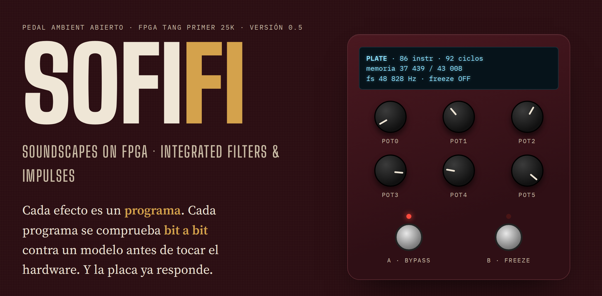
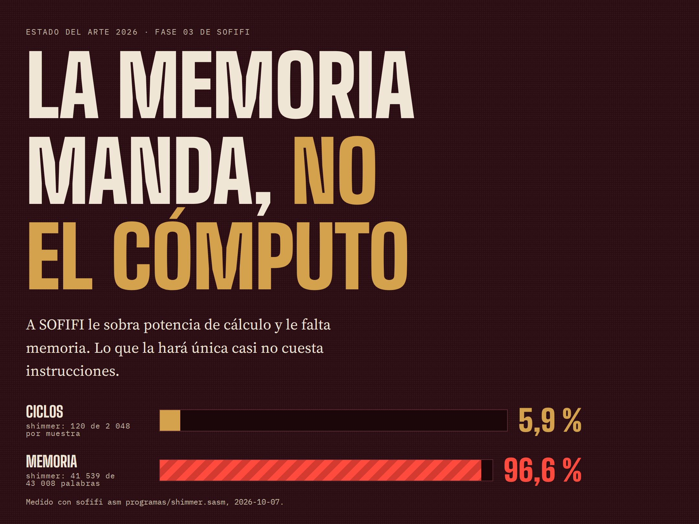
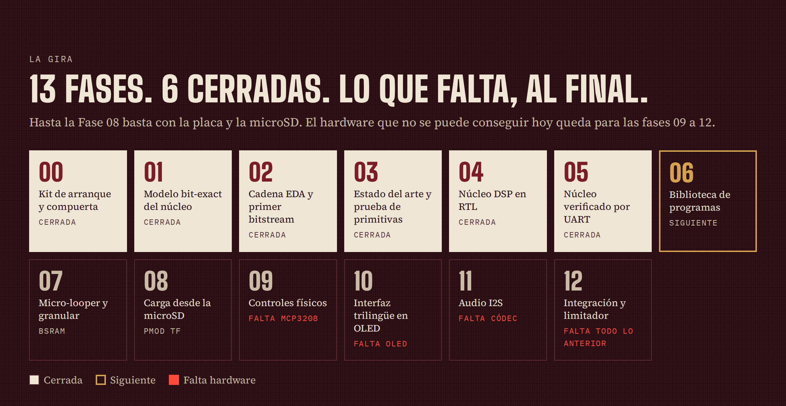

# SOFIFI — Sintetizador de Ondas y Filtros Inmersivos en FPGA Integrada

*En inglés: Soundscapes On FPGA: Integrated Filters & Impulses.*

**Idiomas:** Español (fuente) · [English](README.en.md) · [简体中文](README.zh-CN.md)



SOFIFI es un pedal de guitarra ambient (reverbs, shimmer, delays de cinta, freeze, granular)
implementado en una FPGA **Sipeed Tang Primer 25K** (Gowin GW5A-LV25).

**Versión:** `0.5` (la versión es la última fase cerrada; ver `docs/fases/estado_fases.csv`).

> Estado: **núcleo DSP verificado en el silicio** (Fase 05). En la placa, a
> 100 MHz, el plate da muestra a muestra la misma salida que el modelo bit-exact.
> En simulación coinciden también shimmer y freeze. El modelo deja escuchar en el
> PC los tres programas. Sigue la biblioteca de programas (Fase 06).
> La investigación está en `docs/investigacion/INVESTIGACION.md` y
> `docs/investigacion/ESTADO_DEL_ARTE_2026.md`.

## Escuchar los efectos (sin hardware)

```bash
.venv/bin/sofifi render programas/plate.sasm guitarra.wav out/plate.wav --pot pot0=0.6 --pot pot2=0.4 --cola 4
.venv/bin/sofifi render programas/shimmer.sasm guitarra.wav out/shimmer.wav --pot pot0=0.7 --pot pot2=0.5 --pot pot3=0.6 --cola 6
.venv/bin/sofifi render programas/freeze.sasm guitarra.wav out/freeze.wav --pot pot2=0.5 --freeze 1.5:8 --cola 8
```

| Programa | pot0 | pot1 | pot2 | pot3 | footswitch |
|---|---|---|---|---|---|
| `programas/plate.sasm` | decay | damping | mezcla | — | — |
| `programas/shimmer.sasm` | decay | damping | mezcla | shimmer | — |
| `programas/freeze.sasm` | decay | damping | mezcla | — | `--freeze INICIO:FIN` (segundos) |

En `demo_examples/` hay demos ya procesadas: una guitarra sintética (arpegio
de Em9) pasada por los tres programas. Se regeneran con `scripts/generar_demos.py`.

El WAV de entrada puede ser de 16, 24 o 32 bit y de cualquier frecuencia; se
remuestrea a 48 828 Hz. `sofifi asm` genera el microcódigo (`.hex` + `.json`).

## Qué se va a construir

- **Núcleo DSP microcodificado** al estilo Spin FV-1, ampliado: 2 048 instrucciones
  por muestra, acumulador de 48 bit e interpolación cúbica (ADR 0006). Los efectos
  son *programas*, no módulos RTL.
- **Todo el audio en BSRAM** (unos 0,9–1,4 s de líneas de retardo). La microSD guarda
  presets y grabaciones, pero no sirve de memoria de delay (ADR 0004).
- **fs = 48 828 Hz**, con reloj de sistema de 100 MHz: 2 048 ciclos por muestra
  exactos (ADR 0005).
- **Modelo de referencia bit-exact en Python**, que es el oráculo contra el que se
  valida el RTL (ADR 0003).



El estado del arte de 2026 y la hoja de ruta están en
`docs/investigacion/ESTADO_DEL_ARTE_2026.md`. Las infografías completas están en
`docs/infografias/`.

## Arranque

```bash
make install    # crea .venv con las herramientas del modelo y de la compuerta
make hooks      # instala el pre-push versionado
make ci         # compuerta local completa
```

La disciplina de trabajo está en `docs/SPEC_RAIZ.md`; el mapa para retomar en frío,
en `AGENTS.md`.

### Cadena EDA (Fase 02)

`make install` instala por pip toda la cadena abierta: Yosys y
nextpnr-himbaechel-gowin (YoWASP), apicula, openFPGALoader, verilator y cocotb.

```bash
make sim        # testbenches cocotb del RTL
make prog       # sintetiza hola_uart y lo carga en la SRAM de la Tang Primer 25K
make uart       # lee la UART del depurador (/dev/ttyUSB1) y exige "SOFIFI"
```

Para programar sin sudo hace falta la regla udev del depurador BL616
(`0403:6010`, grupo `plugdev`); se instala una vez con las instrucciones de
`scripts/udev/99-tang-primer-25k.rules`.

### Herramientas opcionales (compuertas blandas)

- `shellcheck`: lint de los scripts.

Si una herramienta falta, la compuerta lo dice (`WARN … NO CORRIÓ`); no finge un verde.

## Hardware

| Pieza | Estado |
|---|---|
| Tang Primer 25K + Dock | disponible |
| microSD de 64 GB (PMOD TF) | disponible |
| Códec I2S (PCM1808 + PCM5102A o Digilent Pmod I2S2) | **falta** (Fase 11) |
| MCP3208 + potenciómetros | falta (Fase 09; los botones de la Dock hacen de footswitch) |
| OLED SSD1306 de 128×64 | falta (Fase 10) |
| Buffer de entrada de guitarra | falta (provisional: cualquier pedal con buffer) |
| Módulo SDRAM de Sipeed | futuro (habilita looper y granular largos) |

Las fases que necesitan hardware que falta van al final del plan (09 a 12), de
modo que hasta la Fase 08 basta con la placa y la microSD.



## Documentación del hardware

- `BOM.md`: lista de compra del hardware, con enlaces.
- `SBOM.md`: qué hace cada componente del FPGA y con qué herramientas se construye.
- `docs/arquitectura_fpga.md`: la arquitectura del FPGA y cómo cambia fase a fase.
- `fails.md`: los fallos encontrados y cómo se resolvieron.

## Idiomas

El español es la fuente canónica. Las traducciones llevan un sello con la huella
de la versión que traducen, y `scripts/check_i18n.py` impide que una traducción
diga estar al día cuando no lo está (ADR 0007). Los ADR, las specs de fase y los
mapas para agentes solo están en español.

## Licencia

MIT (ver `LICENSE`). Solo se porta código de terceros con licencia permisiva, y
cada origen se declara en `docs/terceros.yaml` (ADR 0002).
