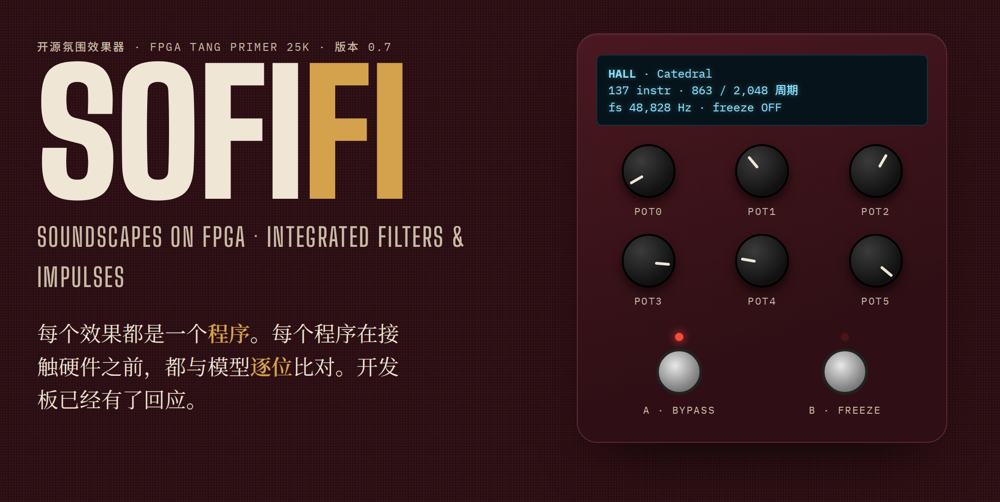
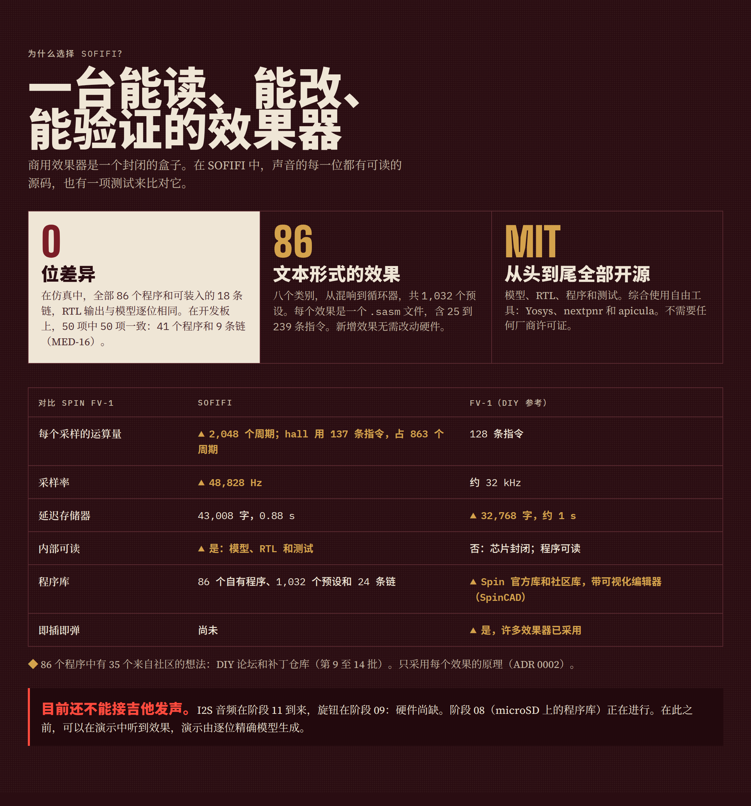
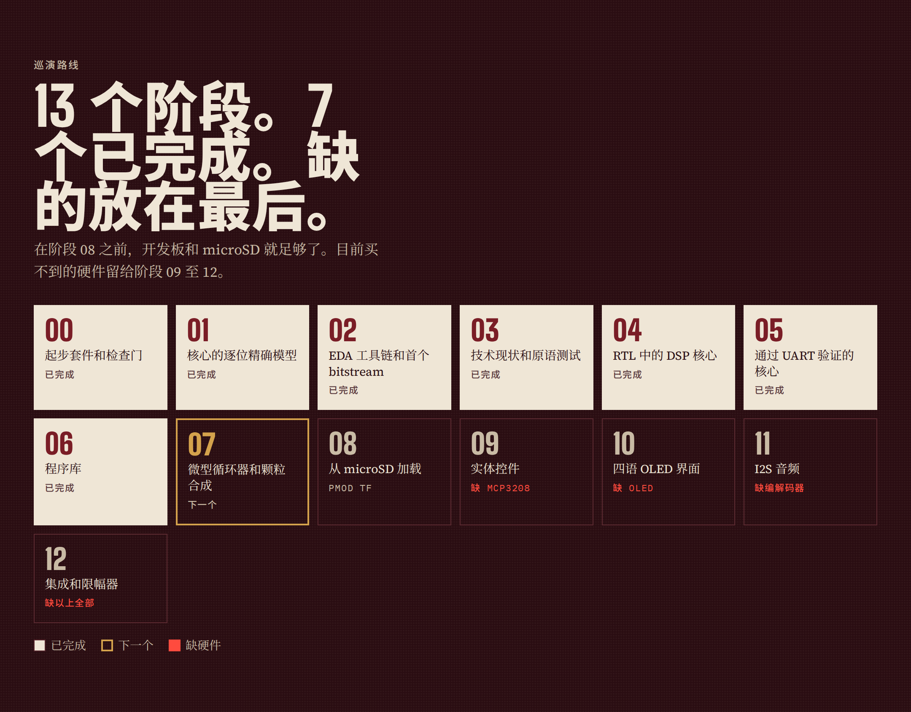

<!-- i18n: fuente=README.md sha=022cb6da352e estado=al_dia -->
# SOFIFI — 集成 FPGA 上的沉浸式波形与滤波合成器

*英文名：Soundscapes On FPGA: Integrated Filters & Impulses；西班牙文名：Sintetizador de Ondas y Filtros Inmersivos en FPGA Integrada。*

**语言：** [Español](README.md)（源文本） · [English](README.en.md) · 简体中文 · [日本語](README.ja.md)



SOFIFI 是一款开源的氛围（ambient）吉他效果器，运行在 **Sipeed Tang Primer 25K**
FPGA（高云 GW5A-LV25）上。每个效果都是一个文本程序，由自研的 DSP 核心执行。

**版本：** `0.7`（版本号即最后一个已关闭的阶段；见 `docs/fases/estado_fases.csv`）。

## 状态

| 项目 | 状态 |
|---|---|
| 程序库 | 8 个类别中共 **81 个程序与 648 个预设**（阶段 07） |
| 同时运行两个效果 | **24 条链**：18 条现在可以装入，6 条等待 SDRAM（`presets/cadenas.toml`，ADR 0013） |
| 与模型一致 | 81 个程序和 18 条可装入的链在 RTL 中的输出与模型逐位一致（仿真） |
| 开发板 | plate 和循环器在芯片上以 100 至 125 MHz 运行，输出与模型逐位一致（阶段 07） |
| 下一步 | 从 microSD 卡加载程序（阶段 08） |
| 接吉他发声 | **尚未实现**：缺少 I2S 编解码器（阶段 11） |

## 无需硬件即可试听效果

1. 试听 `demo_examples/` 中的演示：一段合成吉他（Em9 琶音）经过每个程序，格式为 Ogg Vorbis。
2. 用预设处理自己的 WAV：

```bash
.venv/bin/sofifi presets hall                      # 列出一个程序的预设
.venv/bin/sofifi render programas/hall.sasm guitar.wav out/hall.wav --preset "Catedral" --cola 6
.venv/bin/sofifi render programas/shimmer.sasm guitar.wav out/sh.wav --pot pot0=0.7 --pot pot3=0.6 --cola 6
.venv/bin/sofifi render programas/freeze.sasm guitar.wav out/fz.wav --preset "Congelar suave" --freeze 1.5:8 --cola 8
```

- `--preset` 从 `presets/banco.toml` 读取旋钮值；之后的 `--pot` 可以修改其中一个。
- `--freeze 开始:结束` 在两个时间点（秒）之间按住脚踏开关。
- `--cola` 在结尾添加若干秒静音，以便听到尾音。
- 输入 WAV 可以是 16、24 或 32 位、任意采样率，模型会将其重采样到 48,828 Hz。

| 类别 | 程序 |
|---|---|
| 混响 | plate, plate_vivo, hall, blackhole, cloud, bloom, spring, chorale, resonador, gated, reverb_inversa, infinite, freeze, freeze_givens, shimmer, shimmer_quinta, shimmer_energia |
| 延迟 | delay, cinta, bbd, pingpong, lluvia, ducking, reverse |
| 调制 | chorus, flanger, phaser, tremolo, vibrato, slicer |
| 音高 | octava, armonizador, doblador, escalera |
| 动态 | compresor, puerta, swell |
| 滤波 | autowah, filtro, ancho |
| 质感 | saturacion, lofi, ringmod, granular |
| 循环器 | looper |

`docs/programas.zh-CN.md` 说明每个程序的作用、旋钮和开销，由 `sofifi catalogo` 生成。
程序名和预设名为西班牙语。

## 工作原理

- **微码 DSP 核心**：风格类似 Spin FV-1 并加以扩展——每个样本最多 2,048 条指令、
  48 位累加器和三次插值（ADR 0006）。新效果只是一个 `.sasm` 文件，RTL 无需改动。
- **全部音频位于 FPGA 的 BSRAM 中**：43,008 个字，约 0.88 秒。microSD 卡保存预设和
  录音，但不能用作延迟存储器，因为其写入峰值可达 250 毫秒（ADR 0004）。
- **循环器与颗粒引擎**：使用一个 32,768 字（0.67 秒）的绝对地址区域，循环指针不会移动它。
  `RDAA` 和 `WRAA` 读写该区域（ADR 0009）。有了 SDRAM 之后，循环可以更长。
- **fs = 48,828 Hz**：100 MHz 时钟正好为每个样本提供 2,048 个周期（ADR 0005）。
- **Python 逐位精确参考模型**：RTL 必须逐样本给出与模型相同的位（ADR 0003）。
- **实际开销**：每条指令在 RTL 中耗用 2 到 50 个周期。读取 ACC 的指令要等待上一条指令的结果（ADR 0014，西班牙语）。`sofifi asm` 会给出一个程序的周期数。



完整的信息图位于 `docs/infografias/`。2026 年的技术现状与路线图见
`docs/investigacion/ESTADO_DEL_ARTE_2026.md`（西班牙语）。

## 快速开始

1. 创建包含模型、检查门和 FPGA 工具的环境：`make install`。
2. 安装仓库自带的 pre-push 钩子：`make hooks`。
3. 运行完整的本地检查门：`make ci`。

`docs/SPEC_RAIZ.md` 规定工作纪律；`AGENTS.md` 是从零接手项目的地图。两者均为西班牙语。

### EDA 工具链

`make install` 通过 pip 安装整套开源工具链：Yosys 与 nextpnr-himbaechel-gowin
（YoWASP）、apicula、openFPGALoader、verilator 和 cocotb。

```bash
make sim           # RTL 的 cocotb 测试平台
make prog          # 综合 hola_uart 并加载到 Tang Primer 25K 的 SRAM
make uart          # 读取调试器 UART（/dev/ttyUSB1），要求出现 "SOFIFI"
make esquematicos  # 重新生成 RTL 的 PDF 原理图
```

无需 sudo 编程开发板，需要 BL616 调试器的 udev 规则（`0403:6010`，`plugdev` 组）。
按 `scripts/udev/99-tang-primer-25k.rules` 中的说明安装一次即可。

### 可选工具

| 工具 | 用途 |
|---|---|
| `shellcheck` | 脚本检查（软检查门） |
| Node.js 与 chrome-headless-shell | 原理图（`make esquematicos`）与信息图截图 |

缺少某个工具时，检查门会明确说明（`NO CORRIÓ`，即"未运行"），不会给出虚假的通过。

## 硬件

| 部件 | 状态 |
|---|---|
| Tang Primer 25K + Dock | 已有 |
| 64 GB microSD 卡（PMOD TF） | 已有 |
| I2S 编解码器（PCM1808 + PCM5102A 或 Digilent Pmod I2S2） | **缺少**（阶段 11） |
| MCP3208 + 电位器 | 缺少（阶段 09；Dock 上的按键充当脚踏开关） |
| 128×64 SSD1306 OLED | 缺少（阶段 10） |
| 吉他输入缓冲 | 缺少（临时方案：任意带缓冲的效果器） |
| Sipeed SDRAM 模块 | 未来（用于更长的循环器和颗粒引擎） |

需要缺失硬件的阶段放在最后（09 到 12）。到阶段 08 为止，开发板和 microSD 卡就够了。



## 文档

| 文档 | 内容 |
|---|---|
| `docs/programas.zh-CN.md` | 81 个程序：作用、旋钮、预设与开销 |
| `presets/banco.toml` | 648 个预设 |
| `docs/arquitectura_fpga.zh-CN.md` | FPGA 架构及其在各阶段的变化 |
| `schematics/` | 每个 RTL 模块的 PDF 原理图，由 Verilog 生成 |
| `docs/EXTENDING.zh-CN.md` | 如何添加效果、指令、RTL 模块或检查门 |
| `BOM.zh-CN.md` | 硬件采购清单，附链接 |
| `SBOM.zh-CN.md` | 每个 FPGA 组件的作用以及构建它的工具 |
| `fails.zh-CN.md` | 遇到的故障：现象、原因、解决方法与教训 |

## 语言

- 西班牙语为源文本。
- 公开文档与技术文档有英文、简体中文和日文译本：本 README、信息图、程序目录、演示与原理图指南、
  架构、`EXTENDING`、`BOM`、`SBOM` 和 `fails`。
- 每个译本都带有印记，记录其所翻译版本的指纹。`scripts/check_i18n.py` 会阻止
  一个已过时的译本声称自己是最新的（ADR 0007）。
- ADR、阶段规格、调研与面向智能体的地图仅有西班牙语版本。

## 许可证

MIT（见 `LICENSE`）。只移植许可宽松的第三方代码，每个来源都在
`docs/terceros.yaml` 中声明（ADR 0002）。
