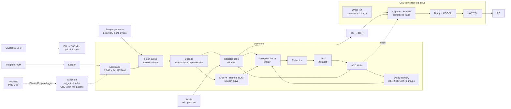

<!-- i18n: fuente=docs/arquitectura_fpga.md sha=f51f5ec843d2 estado=al_dia -->
# FPGA architecture

This document tells what is inside the FPGA, how the parts connect and how the design changed in each phase. We update it when we close each phase and in each PR that changes FPGA blocks. `SBOM.en.md` gives a simple explanation of each component. `fails.en.md` gives the failures that made the design.

Chip: **Gowin GW5A-LV25** (Tang Primer 25K): 23,040 LUT4, 56 BSRAM blocks of 18 Kbit, 28 DSP blocks, 6 PLLs.

## Overview (pipelined core, ADR 0014)

All the logic runs in **one clock domain of 100 MHz** (ADR 0005 (Spanish)). There are two special cases:

- The frequency meter of the tests crosses to the crystal domain in Gray code.
- The microSD clock (SCK) comes from a divider of the 100 MHz clock. It is not a different domain: the MISO input goes through two flip-flops.

The dashed line in the diagram is the load from the microSD. Today it exists only in the `prueba_sd` top, without the core (Phase 08, in progress).

## Blocks

| Block | File | Resources | Latency |
|---|---|---|---|
| PLL 50 → 100 MHz | `rtl/primitivas/pll_100.v` | 1 PLLA | — |
| Sample generator | `rtl/comun/generador_muestra.v` | ~20 LUT | 1 tick / 2,048 cycles |
| Core sequencer | `rtl/nucleo/nucleo.v` | most of the logic | in-order pipeline (ADR 0014, Spanish): 1 decode cycle and 1 or more execution cycles; only an instruction that reads the ACC or a register that was just written waits |
| Microcode | `bsram_pipe` 2,048 × 54 + one register | 6 BSRAM | 4 cycles; continuous fetch into a queue of 4 words and a registered head; a `SKP` that jumps empties the queue (8 cycles) |
| Register bank | in `nucleo.v` | 64 × 24 in flip-flops + 8 candidates + write mask | read in 2 levels: candidates from the queue head, selection at decode; write in 2 stages: first the mask and the data, then the register; a reader waits 3 cycles after a `WRAX` |
| Multiplier | `rtl/primitivas/mult_27x36.v` (with `PREG`) + 1 register | 2 DSP | 5 cycles (`LAT`) |
| Retire line | in `nucleo.v` | 4 stages × (code, one 24-bit operand and pc) | the product and its instruction arrive together at the ALU; the ACC is written in program order |
| ALU | `rtl/nucleo/alu.v` | ~1,000 LUT and 300 ALU | 2 stages; the second stage writes the ACC (7 cycles after the execution) |
| Delay memory | `rtl/nucleo/memoria_retardo.v` + pipelined `bsram_pipe` | 1 BSRAM for each 1,024 words; ~1,700 flip-flops of copies | 9 cycles (`LAT_MEM`), only in `RDA`, `CHO` and `RDAA`. Absolute region of 32,768 words in [P, P + 32,768) if the program uses `RDAA` or `WRAA` |
| Register copies | `rtl/primitivas/registro_copia.v` | `DFF` flip-flops with `keep` | 1 cycle |
| LFO ×4 | `rtl/nucleo/lfo_banco.v` | ~380 LUT and 377 ALU | 26 cycles per sample |
| Hermite ROM | `rtl/nucleo/tabla_hermite.v` (generated) | ~820 LUT | combinational + register |
| Smooth curve | `rtl/nucleo/curva_fin.v` | one subtraction and one saturation | registered |
| UART TX / RX | `rtl/comun/uart_tx.v`, `uart_rx.v` | ~50 LUT each | 115,200 baud |
| Program loader | `rtl/comun/carga_programa.v` | ~30 LUT | instructions + 1 cycles |
| Core trace (HIL only) | `rtl/top/hil_nucleo.v`, command `T` | ~150 flip-flops | records (pc, ACC) in the capture |
| HIL program | `PROGRAMA` parameter of `hil_nucleo`; tops `hil_looper` and `hil_programa` | one ROM in logic | plate by default; the looper tests `RDAA` and `WRAA`; `hil_programa` has the ROM that `sofifi rom` writes (`make hil HIL=NAME`) |
| SD controller | `rtl/sd/sd_spi.v` | ~930 flip-flops and ~390 ALU with the loader (yosys) | SPI mode 0: 400 kHz at start and 12.5 MHz to read; 512-byte blocks with CMD17; read only |
| Bank loader | `rtl/sd/cargador.v`, `rtl/sd/carga_sd.v` | (in the row above) | two passes: it checks the magic value, the limits, the codes and the CRC-32 without a change to the core; then it stops the core, writes and checks the CRC again (Phase 08) |
| SD test | `rtl/top/prueba_sd.v`, `rtl/top/prueba_sd_logica.v` | 2,244 LUT4 and 490 ALU (ratchets RAT-20 and RAT-21) | tests revision v2 of the PMOD TF and then v1; commands `S` (status) and `L` (load a slot) through the UART; `scripts/prueba_sd.py` compares with the model |

## Budget (top `hil_nucleo`, pipelined core, ADR 0014)

| Resource | Use | Notes |
|---|---|---|
| LUT4 | 12,329 of 23,040 (54 %) | Value from nextpnr. It includes the pass-through LUTs of the flip-flops (ratchet RAT-16). The core alone (`nucleo_placa`): 11,982 (RAT-11, F-33). |
| Flip-flops | 7,145 of 23,040 (31 %) | Approximately 3,100 are copies and pipeline registers (F-15); approximately 450 are the queue and the retire line. |
| ALU | 1,318 of 17,280 (8 %) | |
| BSRAM | 56 of 56 | 38 for delay + 6 for microcode + 12 for capture. The final pedal has no capture: 42 + 6 = 48. |
| DSP | 2 of 28 | |
| Frequency | 110 MHz from nextpnr; **125 MHz on the board without errors (3 of 3) and 133.3 MHz (2 of 2)**; the looper, 125 MHz (2 of 2) | real margin of at least 25 % above 100 MHz (ADR 0011, Spanish). The nextpnr value changes with the placement seed (F-33). |
| Cycles per sample | plate 790, hall 863, cloud 907, shimmer 1,037, sostenido 1,190, chorale 1,192; the most expensive program, `dados`, 1,620; the most expensive chain that fits, "Cuerdas en ola", 1,288 of 2,048 | `sofifi asm` and `sofifi cadenas`; exact timing model in `model/sofifi/domain/coste.py` |

## Design rules from the failures

- **No BSRAM output goes to logic in the same cycle.** We make the memories with `bsram_pipe`. It uses the internal output register of the block (F-11).
- **No chained 50-bit arithmetic in one cycle.** The ALU has two stages. The multiplier inputs come from registers (F-10, F-11).
- **A new array gets its `ram_style`.** Yosys changes each array that is read by index into BSRAM, also a small array (F-24). The saturation looks at the three high bits and does not compare with constants (ADR 0014, Spanish).
- **No register drives blocks across all the chip.** Large memories are pipelined. Each group and each block has a copy of the address, and each block has a registered output near it (F-15).
- **No wide multiplexer in one cycle.** The register bank (64:1) has two levels (F-15).
- **The register bank write is not decoded in the same cycle.** First, register a 64-bit mask and the data. Then, write (F-19).
- **Register the signals that go with a registered address together with that address** (F-20).
- **Parallel additions before serial additions.** If a correction depends on a sign, calculate all the options and let the sign select one (F-15).
- **ROMs go in logic**, with `rom_style` in the `case`. This prevents BSRAM `SPX9` (F-09).
- **Measure the timing on the board** (ADR 0011): nextpnr is optimistic by a factor of 1.45 to 1.5 on the GW5A. For a 20 % margin, nextpnr must give approximately 150 MHz or more, and you must measure it. If it fails, `margen_reloj.py --traza` tells which instruction.
- **A nextpnr clock failure after a change that does not touch the logic is placement noise.** With the same netlist, `nucleo_placa` gave 95.41 to 112.10 MHz, as a function of the seed. If only the clock fails, `scripts/fpga.sh` tries the seeds 2, 3 and 4 (F-33).
- **The SD does not open a different clock domain.** SCK comes from a divider of the 100 MHz clock, and MISO goes through two flip-flops. Thus the fast SD clock is a maximum of 12.5 MHz (`DIV_RAPIDO` = 4).

## History by phase

### Phase 02 · First bitstream

UART TX and a counter. No PLL, at 50 MHz. 207 LUT4 after the first second pass (F-07).

### Phase 03 · Primitives

We add the wrappers for the PLL (`pll_100`), the DSP (`mult_27x18`) and the inferred BSRAM (`bsram_dp`). We verified them on the board (MED-06 to MED-08).

### Phase 04 · DSP core in RTL

- Multicycle sequencer: decode, execution with a common wait and a latency `LAT = 3`.
- One 27×36 multiplier for all operations (24×18 and 24×24).
- Delay memory of 42 blocks, LFO, Hermite ROM generated from the model.
- Equal to the model in 63,477 samples (simulation). nextpnr: 140 MHz.

### Phase 05 · Core verified on the board

- **Clear the delay memory** after reset, to start in the same state as the model.
- **UART RX** and top `hil_nucleo`: capture at real speed, dump with CRC-32 when the PC requests it.
- **Pipelining for the silicon** (F-11):
  - `LAT` changes from 3 to 5;
  - BSRAM with output register (`bsram_bloque`, `bsram_pipe`);
  - ALU in two stages;
  - the `CHO` address, in three steps.
- The plate program is bit-exact with the model **in the silicon** at 100 MHz.
- Cost: approximately 13 cycles per instruction, compared to approximately 6 in Phase 04.

### Phase 06 · Prerequisite: read-ahead and 20 % margin

- **Read-ahead:** when the core decodes an instruction, it requests the next one from the microcode. If there is no jump, the next instruction is already read when the core needs it.
- **Pipelining for the silicon** (F-15):
  - delay memory pipelined in groups of 8 blocks, with local copies of the address (`registro_copia`) and registered outputs; a read takes 9 cycles (`LAT_MEM`);
  - register bank in two levels;
  - physical address with three parallel additions;
  - `PREG` in the DSP.
- **Core trace on the board:** the HIL top records (pc, ACC), and the PC tells which instruction fails first.
- Measured margin: **120 MHz without errors**, compared to 106 MHz in Phase 05.
- Cycles per sample: shimmer 1,514 (before: 1,601). The read-ahead saves approximately 150 cycles. The pipelined memory uses approximately 65.

### Phase 06 · Program library (the RTL does not change)

- Six new programs, equal to the model in simulation: hall, cloud, reverse, lofi and swell in 4,883 samples; cinta in 12,000, to get to its first echo.
- **Quantize without AND:** the lo-fi program scales the sample down and rounds it when it writes it to a register (`WRAX`). Then it scales it up again with `SOF`.
- **Variable delay without a new instruction:** the cinta program stops a sine LFO at a quarter turn. Its shape is then 1, and the `CHO` delay follows `lfo0_depth`, which the program writes.
- **Cost of each instruction in the RTL**, measured in simulation and copied to the model (`coste.py`):

| Instruction | Cycles |
|---|---|
| `NOP`, `LDAX`, `CLR`, `ABSA`; `SKP` that does not jump | 6 |
| `SKP` that jumps | 8 |
| `RDAX`, `WRAX`, `WRA`, `WRAP`, `MAXX`, `MULX`, `SOF` | 10 |
| `RDFX` | 11 |
| `CLIP` | 14 |
| `RDA` | 19 |
| `CHO` (with `na`: 57) | 52 |
| Fixed per sample (bound) | 34 |

- A program fits if the sum is 2,048 or less. `sofifi asm` gives the sum and `programas_test.py` makes it mandatory.
- **The cloud program uses 42,814 words: it does not fit in `hil_nucleo`**. That top has 38 delay blocks, to keep space for the capture. To test cloud on the board, you must make the capture smaller.

### Phase 07 · RDAA and WRAA (absolute region)

- **Two new instructions** (ADR 0009 (Spanish), update 2026-10-07): `RDAA` reads with linear interpolation. `WRAA` writes. Both use a region of 32,768 words without a pointer. Register R gives the position.
- **Absolute region:** after the circular memory, in [P, P + 32,768). The physical address is one addition (P + i), in parallel with the circular memory address. The reset also clears the region.
- **Predecoding:** with 18 instructions, a decision in `E_EJEC` from the 6-bit `op` made the control path longer. `E_DECO` keeps the instruction class and some flags in registers.
- **Registered `tick`** at the core input. The inputs are captured on the same clock edge.
- **Register bank write in two stages**, and registered `RDAA` subtraction (F-19). Measured margin: **125 MHz without errors**, compared to 120 MHz in Phase 06.

| Instruction | Cycles |
|---|---|
| `WRAA` | 10 |
| `RDAA` (two reads, the difference multiplied by the fraction, and the product by C) | 27 |

- **Looper on the board** (top `hil_looper`): the HIL stimulus pushes the footswitch to record and to do an overdub. The looper gives the same bits as the model from 100 to 125 MHz. This is the first test of `RDAA` and `WRAA` in the silicon.
- **All the catalogue on the board** (top `hil_programa`, `make hil HIL=NAME`): 41 programs and 9 chains give the same bits as the model (MED-16). These are all the programs and chains that fit in the 38 blocks of `hil_nucleo`. The program that uses the most cycles is `chorale`: 1,935 cycles of 2,048.
- **With the segmented core** (ADR 0014): 68 programs and 9 chains give the same bits as the model (MED-17, 2026-10-10). These are all that fit in `hil_nucleo` when you count the absolute region (F-37). The program that uses the most cycles is `dados`: 1,409 cycles of 2,048.

### After Phase 07 · In-order pipelined core (ADR 0014, Spanish)

- **Decoupled retire:** the instruction puts its product into a retire line, and the sequencer goes to the next instruction. The ACC is written in program order.
- **Waits only for dependencies:** an instruction that reads the ACC waits until the retire line is empty; an instruction that reads the bank waits 3 cycles after a `WRAX`.
- **Fetch queue:** the core requests microcode without stopping; a queue of 4 words and a registered head give the next instruction.
- **Exact timing model:** `coste.py` copies the sequencer; the simulation requires the same cycles as the RTL.
- **Timing:** the first version failed at 125 MHz in the silicon. The trace showed the ACC loop: a forward path before the addition, and a saturation with two 50-bit comparisons. Without the forward path and with the saturation on the high bits: 125 MHz (3 of 3) and 133.3 MHz (2 of 2).

| Instruction | Cycles (multicycle) | Cycles (pipelined), without dependency |
|---|---|---|
| `RDAX`, `WRAX`, `WRA`, `WRAP`, `SOF`, `MULX`, `MAXX` | 10 | 2 |
| `RDA` | 19 | 11 |
| `CHO` (SIN LFO) | 52 | 44 |
| `RDAA` | 27 | 19 |

An instruction that reads the ACC waits 7 cycles after the end of the previous instruction that writes it. On average, the programs use 1.6 times fewer cycles. The series pairs that fit increase from 790 to 1,312 of 2,550 (with the shared registers, ADR 0013, Spanish).

### Phase 08 · Program load from the microSD (in progress)

The card has no file system: it keeps a bank of raw blocks that `sofifi banco` writes (`docs/microsd.md`, Spanish).

- **Format** (`model/sofifi/domain/banco.py`): block 0 is the header; slot *k* starts at block 1 + 28·*k*. Each slot has 1 metadata block and 27 microcode blocks. The bank holds up to 1,024 programs.
- **`sd_spi`:** starts the card in SPI mode with CMD0, CMD8, ACMD41 and CMD58 at 400 kHz. Then it reads 512-byte blocks with CMD17 at 12.5 MHz. It accepts only version 2 cards, for example all SDHC and SDXC cards. It does not write to the card.
- **`cargador`:** makes two passes. The first pass checks the header, the limits, each operation code, the jumps and the two CRC-32 values, without a change to the core. The second pass stops the core, writes the microcode and checks the CRC again. If the second pass fails, the core stays stopped: silence is better than half a program.
- **`prueba_sd`:** the test top, without the core. The PMOD TF has two revisions with CS and SCK on different pins; the top tests v2 and then v1.
- **Status:** the model, the RTL and the top give the same data in simulation, with a card model in cocotb (`sim/sd/tarjeta_sd.py`). **The test with the real card is not done yet.**

### Next planned change

**Measurement 2026-10-08: two or three cores do not fit** (ADR 0013, Spanish). With 2 cores, yosys gives 13,112 LUT4 and 9,928 flip-flops before placement, and nextpnr does not find a legal placement, also with the BSRAM at 78 %. With 3, 19,046 LUT4. Two effects at the same time use chains: a composed program, with no change to the RTL. The owner confirmed: no second core.

The core now waits only for dependencies (ADR 0014, Spanish). The next step for cycles is to read the memory before its turn, or to decrease `LAT` to 3 (ADR 0014, options 3 and 4). Today the memory is a larger limit: that is work for the SDRAM.
