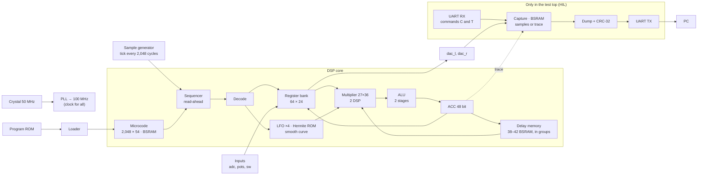

<!-- i18n: fuente=docs/arquitectura_fpga.md sha=f7e2bc47c175 estado=al_dia -->
# FPGA architecture

This document tells what is inside the FPGA, how the parts connect and how the design changed in each phase. We update it when we close each phase and in each PR that changes FPGA blocks. `SBOM.en.md` gives a simple explanation of each component. `fails.en.md` gives the failures that made the design.

Chip: **Gowin GW5A-LV25** (Tang Primer 25K): 23,040 LUT4, 56 BSRAM blocks of 18 Kbit, 28 DSP blocks, 6 PLLs.

## Overview (Phase 06, prerequisite)

All the logic runs in **one clock domain of 100 MHz** (ADR 0005 (Spanish)). There is only one exception: the frequency meter of the tests. It crosses to the crystal domain in Gray code.

## Blocks

| Block | File | Resources | Latency |
|---|---|---|---|
| PLL 50 → 100 MHz | `rtl/primitivas/pll_100.v` | 1 PLLA | — |
| Sample generator | `rtl/comun/generador_muestra.v` | ~20 LUT | 1 tick / 2,048 cycles |
| Core sequencer | `rtl/nucleo/nucleo.v` | most of the logic | ~14 cycles per instruction; it reads the next instruction while it executes the current one; `E_DECO` keeps the instruction class in a register |
| Microcode | `bsram_pipe` 2,048 × 54 + one register | 6 BSRAM | 4 cycles; without a jump, the instruction is already read |
| Register bank | in `nucleo.v` | 64 × 24 in flip-flops + 8 candidates + write mask | read in 2 levels: candidates in `E_LEER`, selection in `E_DECO`; write in 2 stages: mask and data, then the register |
| Multiplier | `rtl/primitivas/mult_27x36.v` (with `PREG`) + 1 register | 2 DSP | 5 cycles (`LAT`) |
| ALU | `rtl/nucleo/alu.v` | ~1,000 LUT and 300 ALU | 2 stages + write |
| Delay memory | `rtl/nucleo/memoria_retardo.v` + pipelined `bsram_pipe` | 1 BSRAM for each 1,024 words; ~1,700 flip-flops of copies | 9 cycles (`LAT_MEM`), only in `RDA`, `CHO` and `RDAA`. Absolute region of 32,768 words in [P, P + 32,768) if the program uses `RDAA` or `WRAA` |
| Register copies | `rtl/primitivas/registro_copia.v` | `DFF` flip-flops with `keep` | 1 cycle |
| LFO ×4 | `rtl/nucleo/lfo_banco.v` | ~380 LUT and 377 ALU | 26 cycles per sample |
| Hermite ROM | `rtl/nucleo/tabla_hermite.v` (generated) | ~820 LUT | combinational + register |
| Smooth curve | `rtl/nucleo/curva_fin.v` | one subtraction and one saturation | registered |
| UART TX / RX | `rtl/comun/uart_tx.v`, `uart_rx.v` | ~50 LUT each | 115,200 baud |
| Program loader | `rtl/comun/carga_programa.v` | ~30 LUT | instructions + 1 cycles |
| Core trace (HIL only) | `rtl/top/hil_nucleo.v`, command `T` | ~150 flip-flops | records (pc, ACC) in the capture |

## Budget (top `hil_nucleo`, Phase 07, RDAA and WRAA)

| Resource | Use | Notes |
|---|---|---|
| LUT4 | 11,428 of 23,040 (50 %) | Value from nextpnr. It includes the pass-through LUTs of the flip-flops. |
| Flip-flops | 6,705 of 23,040 (29 %) | Approximately 3,100 are copies and pipeline registers (F-15). |
| ALU | 1,294 of 17,280 (7 %) | The additions of the absolute region add approximately 100 (F-19). |
| BSRAM | 56 of 56 | 38 for delay + 6 for microcode + 12 for capture. The final pedal has no capture: 42 + 6 = 48. |
| DSP | 2 of 28 | |
| Frequency | 144 MHz from nextpnr; **125 MHz on the board without errors (3 of 3)**; 133.3 MHz, 1 of 1 | real margin of at least 25 % above 100 MHz (F-19, ADR 0011 (Spanish)) |
| Cycles per sample | reverse 431, lofi 620, cinta 658, plate 1,195, freeze 1,313, cloud 1,356, swell 1,467, shimmer 1,514, hall 1,578 of 2,048 | the cost of each instruction is in `model/sofifi/domain/coste.py` |

## Design rules from the failures

- **No BSRAM output goes to logic in the same cycle.** We make the memories with `bsram_pipe`. It uses the internal output register of the block (F-11).
- **No chained 50-bit arithmetic in one cycle.** The ALU has two stages. The multiplier inputs come from registers (F-10, F-11).
- **No register drives blocks across all the chip.** Large memories are pipelined. Each group and each block has a copy of the address, and each block has a registered output near it (F-15).
- **No wide multiplexer in one cycle.** The register bank (64:1) has two levels (F-15).
- **The register bank write is not decoded in the same cycle.** First, register a 64-bit mask and the data. Then, write (F-19).
- **Register the signals that go with a registered address together with that address** (F-20).
- **Parallel additions before serial additions.** If a correction depends on a sign, calculate all the options and let the sign select one (F-15).
- **ROMs go in logic**, with `rom_style` in the `case`. This prevents BSRAM `SPX9` (F-09).
- **Measure the timing on the board** (ADR 0011): nextpnr is optimistic by a factor of 1.45 to 1.5 on the GW5A. For a 20 % margin, nextpnr must give approximately 150 MHz or more, and you must measure it. If it fails, `margen_reloj.py --traza` tells which instruction.

## History by phase

### Phase 02 · First bitstream

UART TX and a counter. No PLL, at 50 MHz. 207 LUT4 after the first second pass (F-07).

### Phase 03 · Primitives

We add the wrappers for the PLL (`pll_100`), the DSP (`mult_27x18`) and the inferred BSRAM (`bsram_dp`). We verified them on the board (MED-06 to MED-08).

### Phase 04 · DSP core in RTL

- Multicycle sequencer: decode, execution with a common wait and a latency `LAT = 3`.
- One 27×36 multiplier for all operations (24×18 and 24×24).
- Delay memory of 42 blocks, LFO, Hermite ROM generated from the model.
- Equal to the model in 63,477 samples (simulation). nextpnr: 140 MHz.

### Phase 05 · Core verified on the board

- **Clear the delay memory** after reset, to start in the same state as the model.
- **UART RX** and top `hil_nucleo`: capture at real speed, dump with CRC-32 when the PC requests it.
- **Pipelining for the silicon** (F-11):
  - `LAT` changes from 3 to 5;
  - BSRAM with output register (`bsram_bloque`, `bsram_pipe`);
  - ALU in two stages;
  - the `CHO` address, in three steps.
- The plate program is bit-exact with the model **in the silicon** at 100 MHz.
- Cost: approximately 13 cycles per instruction, compared to approximately 6 in Phase 04.

### Phase 06 · Prerequisite: read-ahead and 20 % margin

- **Read-ahead:** when the core decodes an instruction, it requests the next one from the microcode. If there is no jump, the next instruction is already read when the core needs it.
- **Pipelining for the silicon** (F-15):
  - delay memory pipelined in groups of 8 blocks, with local copies of the address (`registro_copia`) and registered outputs; a read takes 9 cycles (`LAT_MEM`);
  - register bank in two levels;
  - physical address with three parallel additions;
  - `PREG` in the DSP.
- **Core trace on the board:** the HIL top records (pc, ACC), and the PC tells which instruction fails first.
- Measured margin: **120 MHz without errors**, compared to 106 MHz in Phase 05.
- Cycles per sample: shimmer 1,514 (before: 1,601). The read-ahead saves approximately 150 cycles. The pipelined memory uses approximately 65.

### Phase 06 · Program library (the RTL does not change)

- Six new programs, equal to the model in simulation: hall, cloud, reverse, lofi and swell in 4,883 samples; cinta in 12,000, to get to its first echo.
- **Quantize without AND:** the lo-fi program scales the sample down and rounds it when it writes it to a register (`WRAX`). Then it scales it up again with `SOF`.
- **Variable delay without a new instruction:** the cinta program stops a sine LFO at a quarter turn. Its shape is then 1, and the `CHO` delay follows `lfo0_depth`, which the program writes.
- **Cost of each instruction in the RTL**, measured in simulation and copied to the model (`coste.py`):

| Instruction | Cycles |
|---|---|
| `NOP`, `LDAX`, `CLR`, `ABSA`; `SKP` that does not jump | 6 |
| `SKP` that jumps | 8 |
| `RDAX`, `WRAX`, `WRA`, `WRAP`, `MAXX`, `MULX`, `SOF` | 10 |
| `RDFX` | 11 |
| `CLIP` | 14 |
| `RDA` | 19 |
| `CHO` (with `na`: 57) | 52 |
| Fixed per sample (bound) | 34 |

- A program fits if the sum is 2,048 or less. `sofifi asm` gives the sum and `programas_test.py` makes it mandatory.
- **The cloud program uses 42,814 words: it does not fit in `hil_nucleo`**. That top has 38 delay blocks, to keep space for the capture. To test cloud on the board, you must make the capture smaller.

### Phase 07 · RDAA and WRAA (absolute region)

- **Two new instructions** (ADR 0009 (Spanish), update 2026-10-07): `RDAA` reads with linear interpolation. `WRAA` writes. Both use a region of 32,768 words without a pointer. Register R gives the position.
- **Absolute region:** after the circular memory, in [P, P + 32,768). The physical address is one addition (P + i), in parallel with the circular memory address. The reset also clears the region.
- **Predecoding:** with 18 instructions, a decision in `E_EJEC` from the 6-bit `op` made the control path longer. `E_DECO` keeps the instruction class and some flags in registers.
- **Registered `tick`** at the core input. The inputs are captured on the same clock edge.
- **Register bank write in two stages**, and registered `RDAA` subtraction (F-19). Measured margin: **125 MHz without errors**, compared to 120 MHz in Phase 06.

| Instruction | Cycles |
|---|---|
| `WRAA` | 10 |
| `RDAA` (two reads, the difference multiplied by the fraction, and the product by C) | 27 |

### Next planned change

Now each instruction waits for its result (approximately 14 cycles). The next step is to not wait when the next instruction does not use the ACC or the register that the current instruction writes. This needs the detection of dependencies between instructions. The result stays equal to the model. The change is large, and an ADR will decide it.
