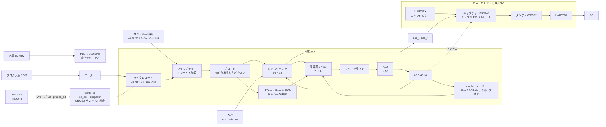

<!-- i18n: fuente=docs/arquitectura_fpga.md sha=4c2e37123255 estado=al_dia -->
# FPGA アーキテクチャ

この文書は、FPGA の中に何があるか、各部がどうつながるか、設計がフェーズごとにどう変わったかを示します。各フェーズの終了時と、FPGA のブロックを変える各 PR で更新します。各コンポーネントの簡単な説明は `SBOM.ja.md` にあります。設計を形づくった障害は `fails.ja.md` にあります。

チップ：**Gowin GW5A-LV25**（Tang Primer 25K）：LUT4 23,040 個、18 Kbit の BSRAM ブロック 56 個、DSP ブロック 28 個、PLL 6 個。

## 全体図（パイプライン化したコア、ADR 0014、スペイン語）

すべてのロジックは **100 MHz の単一クロックドメイン**で動きます（ADR 0005（スペイン語））。特別な場合が 2 つあります。

- テスト用の周波数計は、グレイコードで水晶のクロックドメインへ渡ります。
- microSD のクロック（SCK）は、100 MHz クロックの分周器から出ます。別のドメインではありません：MISO 入力は 2 段のフリップフロップを通ります。

図の破線は microSD からの読み込みです。現在はトップ `prueba_sd` の中だけにあり、コアは含みません（フェーズ 08、作業中）。

## ブロック

| ブロック | ファイル | リソース | レイテンシー |
|---|---|---|---|
| PLL 50 → 100 MHz | `rtl/primitivas/pll_100.v` | PLLA 1 個 | — |
| サンプル生成器 | `rtl/comun/generador_muestra.v` | ~20 LUT | 2,048 サイクルに 1 tick |
| コアのシーケンサー | `rtl/nucleo/nucleo.v` | ロジックの大部分 | インオーダーのパイプライン（ADR 0014、スペイン語）：デコード 1 サイクルと実行 1 サイクル以上。待つのは、ACC か書いたばかりのレジスタを読む命令だけ |
| マイクロコード | `bsram_pipe` 2,048 × 54 + レジスタ 1 個 | 6 BSRAM | 4 サイクル。4 ワードのキューと登録済みの先頭へ連続してフェッチする。ジャンプする `SKP` はキューを空にする（8 サイクル） |
| レジスタバンク | `nucleo.v` の中 | フリップフロップで 64 × 24 + 候補 8 個 + 書き込みマスク | 読み出しは 2 段：キューの先頭で候補、デコードで選択。書き込みは 2 段：まずマスクとデータ、次にレジスタ。`WRAX` の後、読む命令は 3 サイクル待つ |
| 乗算器 | `rtl/primitivas/mult_27x36.v`（`PREG` 付き）+ レジスタ 1 個 | 2 DSP | 5 サイクル（`LAT`） |
| リタイアライン | `nucleo.v` の中 | 4 段 ×（コード、24 ビットのオペランド 1 個、pc） | 積とその命令が一緒に ALU に着く。ACC はプログラムの順番で書かれる |
| ALU | `rtl/nucleo/alu.v` | ~1,000 LUT と 300 ALU | 2 段。2 段目が ACC を書く（実行から 7 サイクル） |
| ディレイメモリー | `rtl/nucleo/memoria_retardo.v` + パイプライン化した `bsram_pipe` | 1,024 ワードごとに 1 BSRAM。コピー用フリップフロップ ~1,700 個 | 9 サイクル（`LAT_MEM`）、`RDA`、`CHO`、`RDAA` のみ。プログラムが `RDAA` か `WRAA` を使うと、[P, P + 32,768) に 32,768 ワードの絶対領域 |
| レジスタのコピー | `rtl/primitivas/registro_copia.v` | `keep` 付きの `DFF` フリップフロップ | 1 サイクル |
| LFO ×4 | `rtl/nucleo/lfo_banco.v` | ~380 LUT と 377 ALU | 1 サンプルあたり 26 サイクル |
| Hermite ROM | `rtl/nucleo/tabla_hermite.v`（生成） | ~820 LUT | 組み合わせ回路 + レジスタ |
| なめらかな曲線 | `rtl/nucleo/curva_fin.v` | 減算 1 回と飽和 1 回 | レジスタ出力 |
| UART TX / RX | `rtl/comun/uart_tx.v`、`uart_rx.v` | それぞれ ~50 LUT | 115,200 ボー |
| プログラムローダー | `rtl/comun/carga_programa.v` | ~30 LUT | 命令数 + 1 サイクル |
| コアのトレース（HIL のみ） | `rtl/top/hil_nucleo.v`、コマンド `T` | ~150 フリップフロップ | (pc, ACC) をキャプチャに記録 |
| HIL のプログラム | `hil_nucleo` のパラメーター `PROGRAMA`、トップ `hil_looper` と `hil_programa` | ロジック上の ROM 1 つ | 既定は plate。looper で `RDAA` と `WRAA` を試験。`hil_programa` は `sofifi rom` が書く ROM を使う（`make hil HIL=名前`） |
| SD コントローラー | `rtl/sd/sd_spi.v` | ローダーと合わせて約 930 フリップフロップと約 390 ALU（yosys） | SPI モード 0：起動時 400 kHz、読み出し時 12.5 MHz。CMD17 で 512 バイトのブロック。読み出しのみ |
| バンクのローダー | `rtl/sd/cargador.v`、`rtl/sd/carga_sd.v` | （前の行に含む） | 2 回：まずコアに触れずにマジック値、範囲、命令コード、CRC-32 を確認。次にコアを止めて書き込み、CRC をもう一度確認（フェーズ 08） |
| SD のテスト | `rtl/top/prueba_sd.v`、`rtl/top/prueba_sd_logica.v` | 2,244 LUT4 と 490 ALU（ラチェット RAT-20 と RAT-21） | PMOD TF のリビジョン v2 を試し、次に v1 を試す。UART のコマンド `S`（状態）と `L`（スロットの読み込み）。`scripts/prueba_sd.py` がモデルと比較する |

## リソース予算（トップ `hil_nucleo`、パイプライン化したコア、ADR 0014）

| リソース | 使用量 | 備考 |
|---|---|---|
| LUT4 | 23,040 中 12,329（54 %） | nextpnr の値。フリップフロップ用の通過 LUT を含む（ラチェット RAT-16）。コアだけ（`nucleo_placa`）では 11,982（RAT-11、F-33）。 |
| フリップフロップ | 23,040 中 7,145（31 %） | 約 3,100 個はコピーとパイプラインレジスタ（F-15）。約 450 個はキューとリタイアライン。 |
| ALU | 17,280 中 1,318（8 %） | |
| BSRAM | 56 中 56 | ディレイ用 38 + マイクロコード用 6 + キャプチャ用 12。最終的なペダルにはキャプチャがない：42 + 6 = 48。 |
| DSP | 28 中 2 | |
| 周波数 | nextpnr で 110 MHz。**ボード上で 125 MHz、エラーなし（3 回中 3 回）、133.3 MHz（2 回中 2 回）**。ルーパーは 125 MHz（2 回中 2 回） | 100 MHz に対する実際のマージンは少なくとも 25 %（ADR 0011、スペイン語）。nextpnr の値は配置のシードで変わる（F-33）。 |
| 1 サンプルあたりのサイクル数 | 2,048 のうち plate 790、hall 863、cloud 907、shimmer 1,037、sostenido 1,190、chorale 1,192。最も重いプログラム `dados` は 1,620。収まるチェーンで最も重い「Cuerdas en ola」は 1,288 | `sofifi asm` と `sofifi cadenas`。正確なタイミングモデルは `model/sofifi/domain/coste.py` にある |

## 障害から得た設計ルール

- **BSRAM の出力を同じサイクルでロジックに入れない。** メモリーは `bsram_pipe` で作る。これはブロック内部の出力レジスタを使う（F-11）。
- **50 bit の演算を 1 サイクルで連鎖させない。** ALU は 2 段。乗算器の入力はレジスタから来る（F-10、F-11）。
- **新しい配列には `ram_style` を付ける。** Yosys は、インデックスで読む配列を小さくても BSRAM に変える（F-24）。飽和は上位 3 ビットを見て、定数とは比較しない（ADR 0014、スペイン語）。
- **1 個のレジスタでチップ全体のブロックを駆動しない。** 大きなメモリーはパイプライン化する。グループごと・ブロックごとにアドレスのコピーを置き、各ブロックの近くに出力レジスタを置く（F-15）。
- **幅の広いマルチプレクサーを 1 サイクルに置かない。** レジスタバンク（64:1）は 2 段（F-15）。
- **バンクへの書き込みを同じサイクルでデコードしない。** まず 64 bit のマスクとデータをレジスタに入れ、次に書き込む（F-19）。
- **レジスタに入れたアドレスに付随する信号は、アドレスと一緒にレジスタに入れる**（F-20）。
- **直列の加算より並列の加算。** 補正が符号に依存するなら、すべての選択肢を計算し、符号で選ぶ（F-15）。
- **ROM はロジックに置く。** `case` に `rom_style` を付けて、BSRAM `SPX9` にならないようにする（F-09）。
- **タイミングはボード上で測る**（ADR 0011）：GW5A では nextpnr は 1.45〜1.5 倍楽観的。20 % のマージンには、nextpnr で約 150 MHz 以上が必要で、それを実測する。失敗したら、`margen_reloj.py --traza` がどの命令かを示す。
- **ロジックに触れない変更の後の nextpnr のクロック不合格は、配置のノイズである。** 同じネットリストで、`nucleo_placa` はシードにより 95.41〜112.10 MHz を出した。クロックだけが失敗したとき、`scripts/fpga.sh` はシード 2、3、4 を試す（F-33）。
- **SD は別のクロックドメインを作らない。** SCK は 100 MHz クロックの分周器から出し、MISO は 2 段のフリップフロップを通す。このため、SD の高速クロックは 12.5 MHz を超えない（`DIV_RAPIDO` = 4）。

## フェーズごとの履歴

### フェーズ 02 · 最初のビットストリーム

UART TX とカウンター 1 個。PLL なし、50 MHz。最初の「セカンドパス」後に 207 LUT4（F-07）。

### フェーズ 03 · プリミティブ

PLL（`pll_100`）、DSP（`mult_27x18`）、推論 BSRAM（`bsram_dp`）のラッパーを追加し、ボード上で検証した（MED-06〜MED-08）。

### フェーズ 04 · RTL の DSP コア

- マルチサイクルのシーケンサー：デコード、共通の待ちを持つ実行、レイテンシー `LAT = 3`。
- すべての演算（24×18 と 24×24）に 27×36 の乗算器を 1 個だけ使う。
- 42 ブロックのディレイメモリー、LFO、モデルから生成した Hermite ROM。
- 63,477 サンプルでモデルと一致（シミュレーション）。nextpnr：140 MHz。

### フェーズ 05 · ボード上で検証したコア

- リセット後に**ディレイメモリーを消去**し、モデルと同じ状態から始める。
- **UART RX** とトップ `hil_nucleo`：実速度でキャプチャし、PC の要求で CRC-32 付きでダンプする。
- **シリコン向けのパイプライン化**（F-11）：
  - `LAT` を 3 から 5 に変更；
  - 出力レジスタ付きの BSRAM（`bsram_bloque`、`bsram_pipe`）；
  - ALU を 2 段に；
  - `CHO` のアドレスを 3 ステップで計算。
- plate プログラムは 100 MHz で**シリコン上で**モデルとビット単位で一致する。
- コスト：1 命令あたり約 13 サイクル。フェーズ 04 では約 6 サイクル。

### フェーズ 06 · 前提条件：先読みと 20 % のマージン

- **先読み：** 命令をデコードするとき、次の命令をマイクロコードに要求する。ジャンプがなければ、必要なときには次の命令がすでに読み出し済み。
- **シリコン向けのパイプライン化**（F-15）：
  - ディレイメモリーを 8 ブロックのグループでパイプライン化。アドレスのローカルコピー（`registro_copia`）と出力レジスタ付き。読み出しは 9 サイクル（`LAT_MEM`）；
  - レジスタバンクを 2 段に；
  - 物理アドレスを 3 つの並列加算で計算；
  - DSP 内部の `PREG`。
- **ボード上のコアのトレース：** HIL トップが (pc, ACC) を記録し、PC が最初に失敗する命令を示す。
- 実測マージン：**120 MHz でエラーなし**。フェーズ 05 では 106 MHz。
- 1 サンプルあたりのサイクル数：shimmer 1,514（以前は 1,601）。先読みで約 150 サイクル減り、分割したメモリーで約 65 サイクル増える。

### フェーズ 06 · プログラムライブラリ（RTL は変わらない）

- 新しいプログラム 6 本。シミュレーションでモデルと一致：hall、cloud、reverse、lofi、swell は 4,883 サンプル。cinta は最初のエコーに届くよう 12,000 サンプル。
- **AND を使わない量子化：** lo-fi プログラムはサンプルを縮小し、レジスタに書くとき（`WRAX`）に丸める。その後 `SOF` で再び拡大する。
- **新しい命令なしの可変ディレイ：** cinta プログラムは正弦波 LFO を 1/4 周期の位置で止める。そのとき波形の値は 1 になり、`CHO` のディレイはプログラムが書く `lfo0_depth` に従う。
- **RTL での各命令のコスト**。シミュレーションで測定し、モデル（`coste.py`）にコピーした：

| 命令 | サイクル |
|---|---|
| `NOP`、`LDAX`、`CLR`、`ABSA`；ジャンプしない `SKP` | 6 |
| ジャンプする `SKP` | 8 |
| `RDAX`、`WRAX`、`WRA`、`WRAP`、`MAXX`、`MULX`、`SOF` | 10 |
| `RDFX` | 11 |
| `CLIP` | 14 |
| `RDA` | 19 |
| `CHO`（`na` 付き：57） | 52 |
| サンプルごとの固定分（上限） | 34 |

- 合計が 2,048 以下ならプログラムは収まる。`sofifi asm` が合計を出し、`programas_test.py` がそれを要求する。
- **cloud プログラムは 42,814 ワードを使う：`hil_nucleo` には収まらない**。このトップはキャプチャの場所を残すため、ディレイ用ブロックが 38 個しかない。ボード上で cloud を試すには、キャプチャを小さくする必要がある。

### フェーズ 07 · RDAA と WRAA（絶対領域）

- **2 つの新しい命令**（ADR 0009（スペイン語）、2026-10-07 の更新）：`RDAA` は線形補間で読み、`WRAA` はポインターなしで 32,768 ワードの領域に書く。レジスタ R が位置を与える。
- **絶対領域：** 循環メモリーの後ろ、[P, P + 32,768) にある。物理アドレスは加算 1 回（P + i）で、循環メモリーのアドレスと並列に計算する。リセットはこの領域も消去する。
- **プリデコード：** 命令が 18 個になり、6 bit の `op` から `E_EJEC` で判断すると制御が長くなった。`E_DECO` が命令のクラスといくつかのフラグをレジスタに残す。
- **`tick` をレジスタに入れる：** コアの入口で、入力と同じクロックエッジで取り込む。
- **バンクへの書き込みを 2 段に**し、`RDAA` の減算をレジスタに入れる（F-19）。実測マージン：**125 MHz でエラーなし**。フェーズ 06 では 120 MHz。

| 命令 | サイクル |
|---|---|
| `WRAA` | 10 |
| `RDAA`（読み出し 2 回、差に小数部を掛け、積に C を掛ける） | 27 |

- **ボード上のルーパー**（トップ `hil_looper`）：HIL の刺激がフットスイッチを押して録音し、次にオーバーダブする。100〜125 MHz で、ルーパーはモデルとビット単位で一致する。これが `RDAA` と `WRAA` の初めてのシリコン上の試験である。
- **カタログ全体をボードで**（トップ `hil_programa`、`make hil HIL=名前`）：41 のプログラムと 9 のチェーンがモデルとビット単位で一致する（MED-16）。`hil_nucleo` の 38 ブロックに収まるものはすべてである。最もサイクルを使うのは `chorale` で、2,048 中 1,935。

### フェーズ 07 の後 · インオーダーのパイプライン化したコア（ADR 0014、スペイン語）

- **切り離したリタイア：** 命令は積をリタイアラインに入れ、シーケンサーは次の命令に進む。ACC はプログラムの順番で書かれる。
- **依存があるときだけ待つ：** ACC を読む命令はリタイアラインが空になるまで待つ。バンクを読む命令は `WRAX` の後 3 サイクル待つ。
- **フェッチキュー：** コアは止まらずにマイクロコードを要求する。4 ワードのキューと登録済みの先頭が次の命令を出す。
- **正確なタイミングモデル：** `coste.py` はシーケンサーを写す。シミュレーションは RTL と同じサイクル数を求める。
- **タイミング：** 最初の版はシリコン上で 125 MHz で失敗した。トレースは ACC のループを示した：加算の前のフォワーディングと、50 ビットの比較 2 つによる飽和である。フォワーディングをなくし、上位ビットで飽和させると、125 MHz（3 回中 3 回）、133.3 MHz（2 回中 2 回）。

| 命令 | サイクル（マルチサイクル） | サイクル（パイプライン）、依存なし |
|---|---|---|
| `RDAX`、`WRAX`、`WRA`、`WRAP`、`SOF`、`MULX`、`MAXX` | 10 | 2 |
| `RDA` | 19 | 11 |
| `CHO`（SIN LFO） | 52 | 44 |
| `RDAA` | 27 | 19 |

ACC を読む命令は、それを書く前の命令の終わりから 7 サイクル待つ。平均で、プログラムのサイクルは 1.6 分の 1 になる。収まる直列のペアは 2,550 中 790 から 1,312 に増える（共有レジスタと合わせて、ADR 0013、スペイン語）。

### フェーズ 08 · microSD からのプログラムの読み込み（作業中）

カードにはファイルシステムがない。`sofifi banco` が書く生ブロックのバンクを保存する（`docs/microsd.md`、スペイン語）。

- **形式**（`model/sofifi/domain/banco.py`）：ブロック 0 はヘッダー。スロット *k* はブロック 1 + 28·*k* から始まる。各スロットはメタデータ 1 ブロックとマイクロコード 27 ブロック。バンクは最大 1,024 のプログラムを持てる。
- **`sd_spi`：** CMD0、CMD8、ACMD41、CMD58 を使い、400 kHz でカードを SPI モードで起動する。次に CMD17 を使い、12.5 MHz で 512 バイトのブロックを読む。受け付けるのはバージョン 2 のカードだけで、SDHC と SDXC はすべてこれにあたる。カードには書き込まない。
- **`cargador`：** 2 回読む。1 回目はコアに触れずに、ヘッダー、範囲、各命令コード、ジャンプ、2 つの CRC-32 を確認する。2 回目はコアを止め、マイクロコードを書き、CRC をもう一度確認する。2 回目が失敗すると、コアは止まったままになる：途中までのプログラムより無音のほうがよい。
- **`prueba_sd`：** コアを含まないテスト用トップ。PMOD TF には、CS と SCK のピンが異なる 2 つのリビジョンがある。トップは v2 を試し、次に v1 を試す。
- **状況：** モデル、RTL、トップは、cocotb のカードモデル（`sim/sd/tarjeta_sd.py`）を使ったシミュレーションで同じデータを出す。**実際のカードでの試験が残っている。**

### 次に予定している変更

**2026-10-08 の測定：2 つや 3 つのコアは収まらない**（ADR 0013、スペイン語）。コアが 2 つだと、yosys は配置前に 13,112 LUT4 と 9,928 フリップフロップを出し、nextpnr は合法な配置を見つけられない。BSRAM が 78 % でも同じである。3 つでは 19,046 LUT4。2 つのエフェクトを同時に使うにはチェーンを使う：RTL を変えない合成プログラムである。所有者は 2 つ目のコアを使わないことを確認した。

コアはもう依存があるときだけ待つ（ADR 0014、スペイン語）。サイクルの次の改善は、メモリーを順番の前に読むこと、または `LAT` を 3 に下げることだ（ADR 0014、選択肢 3 と 4）。今はメモリーの方が大きな制限であり、それは SDRAM の仕事である。
