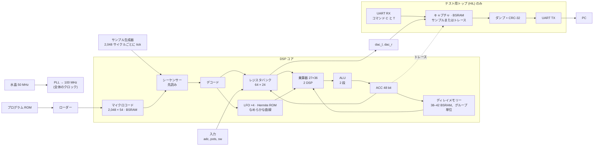

<!-- i18n: fuente=docs/arquitectura_fpga.md sha=f7e2bc47c175 estado=al_dia -->
# FPGA アーキテクチャ

この文書は、FPGA の中に何があるか、各部がどうつながるか、設計がフェーズごとにどう変わったかを示します。各フェーズの終了時と、FPGA のブロックを変える各 PR で更新します。各コンポーネントの簡単な説明は `SBOM.ja.md` にあります。設計を形づくった障害は `fails.ja.md` にあります。

チップ：**Gowin GW5A-LV25**（Tang Primer 25K）：LUT4 23,040 個、18 Kbit の BSRAM ブロック 56 個、DSP ブロック 28 個、PLL 6 個。

## 全体図（フェーズ 06、前提条件）

すべてのロジックは **100 MHz の単一クロックドメイン**で動きます（ADR 0005（スペイン語））。唯一の例外はテスト用の周波数計です。これはグレイコードで水晶のクロックドメインへ渡ります。

## ブロック

| ブロック | ファイル | リソース | レイテンシー |
|---|---|---|---|
| PLL 50 → 100 MHz | `rtl/primitivas/pll_100.v` | PLLA 1 個 | — |
| サンプル生成器 | `rtl/comun/generador_muestra.v` | ~20 LUT | 2,048 サイクルに 1 tick |
| コアのシーケンサー | `rtl/nucleo/nucleo.v` | ロジックの大部分 | 1 命令あたり ~14 サイクル。現在の命令を実行しながら次の命令を読む。`E_DECO` が命令のクラスをレジスタに残す |
| マイクロコード | `bsram_pipe` 2,048 × 54 + レジスタ 1 個 | 6 BSRAM | 4 サイクル。ジャンプがなければ、すでに読み出し済み |
| レジスタバンク | `nucleo.v` の中 | フリップフロップで 64 × 24 + 候補 8 個 + 書き込みマスク | 読み出しは 2 段：`E_LEER` で候補、`E_DECO` で選択。書き込みは 2 段：まずマスクとデータ、次にレジスタ |
| 乗算器 | `rtl/primitivas/mult_27x36.v`（`PREG` 付き）+ レジスタ 1 個 | 2 DSP | 5 サイクル（`LAT`） |
| ALU | `rtl/nucleo/alu.v` | ~1,000 LUT と 300 ALU | 2 段 + 書き込み |
| ディレイメモリー | `rtl/nucleo/memoria_retardo.v` + パイプライン化した `bsram_pipe` | 1,024 ワードごとに 1 BSRAM。コピー用フリップフロップ ~1,700 個 | 9 サイクル（`LAT_MEM`）、`RDA`、`CHO`、`RDAA` のみ。プログラムが `RDAA` か `WRAA` を使うと、[P, P + 32,768) に 32,768 ワードの絶対領域 |
| レジスタのコピー | `rtl/primitivas/registro_copia.v` | `keep` 付きの `DFF` フリップフロップ | 1 サイクル |
| LFO ×4 | `rtl/nucleo/lfo_banco.v` | ~380 LUT と 377 ALU | 1 サンプルあたり 26 サイクル |
| Hermite ROM | `rtl/nucleo/tabla_hermite.v`（生成） | ~820 LUT | 組み合わせ回路 + レジスタ |
| なめらかな曲線 | `rtl/nucleo/curva_fin.v` | 減算 1 回と飽和 1 回 | レジスタ出力 |
| UART TX / RX | `rtl/comun/uart_tx.v`、`uart_rx.v` | それぞれ ~50 LUT | 115,200 ボー |
| プログラムローダー | `rtl/comun/carga_programa.v` | ~30 LUT | 命令数 + 1 サイクル |
| コアのトレース（HIL のみ） | `rtl/top/hil_nucleo.v`、コマンド `T` | ~150 フリップフロップ | (pc, ACC) をキャプチャに記録 |

## リソース予算（トップ `hil_nucleo`、フェーズ 07、RDAA と WRAA）

| リソース | 使用量 | 備考 |
|---|---|---|
| LUT4 | 23,040 中 11,428（50 %） | nextpnr の値。フリップフロップ用の通過 LUT を含む。 |
| フリップフロップ | 23,040 中 6,705（29 %） | 約 3,100 個はコピーとパイプラインレジスタ（F-15）。 |
| ALU | 17,280 中 1,294（7 %） | 絶対領域の加算で約 100 増える（F-19）。 |
| BSRAM | 56 中 56 | ディレイ用 38 + マイクロコード用 6 + キャプチャ用 12。最終的なペダルにはキャプチャがない：42 + 6 = 48。 |
| DSP | 28 中 2 | |
| 周波数 | nextpnr で 144 MHz。**ボード上で 125 MHz、エラーなし（3 回中 3 回）**。133.3 MHz では 1 回中 1 回 | 100 MHz に対する実際のマージンは少なくとも 25 %（F-19、ADR 0011（スペイン語）） |
| 1 サンプルあたりのサイクル数 | 2,048 のうち reverse 431、lofi 620、cinta 658、plate 1,195、freeze 1,313、cloud 1,356、swell 1,467、shimmer 1,514、hall 1,578 | 各命令のコストは `model/sofifi/domain/coste.py` にある |

## 障害から得た設計ルール

- **BSRAM の出力を同じサイクルでロジックに入れない。** メモリーは `bsram_pipe` で作る。これはブロック内部の出力レジスタを使う（F-11）。
- **50 bit の演算を 1 サイクルで連鎖させない。** ALU は 2 段。乗算器の入力はレジスタから来る（F-10、F-11）。
- **1 個のレジスタでチップ全体のブロックを駆動しない。** 大きなメモリーはパイプライン化する。グループごと・ブロックごとにアドレスのコピーを置き、各ブロックの近くに出力レジスタを置く（F-15）。
- **幅の広いマルチプレクサーを 1 サイクルに置かない。** レジスタバンク（64:1）は 2 段（F-15）。
- **バンクへの書き込みを同じサイクルでデコードしない。** まず 64 bit のマスクとデータをレジスタに入れ、次に書き込む（F-19）。
- **レジスタに入れたアドレスに付随する信号は、アドレスと一緒にレジスタに入れる**（F-20）。
- **直列の加算より並列の加算。** 補正が符号に依存するなら、すべての選択肢を計算し、符号で選ぶ（F-15）。
- **ROM はロジックに置く。** `case` に `rom_style` を付けて、BSRAM `SPX9` にならないようにする（F-09）。
- **タイミングはボード上で測る**（ADR 0011）：GW5A では nextpnr は 1.45〜1.5 倍楽観的。20 % のマージンには、nextpnr で約 150 MHz 以上が必要で、それを実測する。失敗したら、`margen_reloj.py --traza` がどの命令かを示す。

## フェーズごとの履歴

### フェーズ 02 · 最初のビットストリーム

UART TX とカウンター 1 個。PLL なし、50 MHz。最初の「セカンドパス」後に 207 LUT4（F-07）。

### フェーズ 03 · プリミティブ

PLL（`pll_100`）、DSP（`mult_27x18`）、推論 BSRAM（`bsram_dp`）のラッパーを追加し、ボード上で検証した（MED-06〜MED-08）。

### フェーズ 04 · RTL の DSP コア

- マルチサイクルのシーケンサー：デコード、共通の待ちを持つ実行、レイテンシー `LAT = 3`。
- すべての演算（24×18 と 24×24）に 27×36 の乗算器を 1 個だけ使う。
- 42 ブロックのディレイメモリー、LFO、モデルから生成した Hermite ROM。
- 63,477 サンプルでモデルと一致（シミュレーション）。nextpnr：140 MHz。

### フェーズ 05 · ボード上で検証したコア

- リセット後に**ディレイメモリーを消去**し、モデルと同じ状態から始める。
- **UART RX** とトップ `hil_nucleo`：実速度でキャプチャし、PC の要求で CRC-32 付きでダンプする。
- **シリコン向けのパイプライン化**（F-11）：
  - `LAT` を 3 から 5 に変更；
  - 出力レジスタ付きの BSRAM（`bsram_bloque`、`bsram_pipe`）；
  - ALU を 2 段に；
  - `CHO` のアドレスを 3 ステップで計算。
- plate プログラムは 100 MHz で**シリコン上で**モデルとビット単位で一致する。
- コスト：1 命令あたり約 13 サイクル。フェーズ 04 では約 6 サイクル。

### フェーズ 06 · 前提条件：先読みと 20 % のマージン

- **先読み：** 命令をデコードするとき、次の命令をマイクロコードに要求する。ジャンプがなければ、必要なときには次の命令がすでに読み出し済み。
- **シリコン向けのパイプライン化**（F-15）：
  - ディレイメモリーを 8 ブロックのグループでパイプライン化。アドレスのローカルコピー（`registro_copia`）と出力レジスタ付き。読み出しは 9 サイクル（`LAT_MEM`）；
  - レジスタバンクを 2 段に；
  - 物理アドレスを 3 つの並列加算で計算；
  - DSP 内部の `PREG`。
- **ボード上のコアのトレース：** HIL トップが (pc, ACC) を記録し、PC が最初に失敗する命令を示す。
- 実測マージン：**120 MHz でエラーなし**。フェーズ 05 では 106 MHz。
- 1 サンプルあたりのサイクル数：shimmer 1,514（以前は 1,601）。先読みで約 150 サイクル減り、分割したメモリーで約 65 サイクル増える。

### フェーズ 06 · プログラムライブラリ（RTL は変わらない）

- 新しいプログラム 6 本。シミュレーションでモデルと一致：hall、cloud、reverse、lofi、swell は 4,883 サンプル。cinta は最初のエコーに届くよう 12,000 サンプル。
- **AND を使わない量子化：** lo-fi プログラムはサンプルを縮小し、レジスタに書くとき（`WRAX`）に丸める。その後 `SOF` で再び拡大する。
- **新しい命令なしの可変ディレイ：** cinta プログラムは正弦波 LFO を 1/4 周期の位置で止める。そのとき波形の値は 1 になり、`CHO` のディレイはプログラムが書く `lfo0_depth` に従う。
- **RTL での各命令のコスト**。シミュレーションで測定し、モデル（`coste.py`）にコピーした：

| 命令 | サイクル |
|---|---|
| `NOP`、`LDAX`、`CLR`、`ABSA`；ジャンプしない `SKP` | 6 |
| ジャンプする `SKP` | 8 |
| `RDAX`、`WRAX`、`WRA`、`WRAP`、`MAXX`、`MULX`、`SOF` | 10 |
| `RDFX` | 11 |
| `CLIP` | 14 |
| `RDA` | 19 |
| `CHO`（`na` 付き：57） | 52 |
| サンプルごとの固定分（上限） | 34 |

- 合計が 2,048 以下ならプログラムは収まる。`sofifi asm` が合計を出し、`programas_test.py` がそれを要求する。
- **cloud プログラムは 42,814 ワードを使う：`hil_nucleo` には収まらない**。このトップはキャプチャの場所を残すため、ディレイ用ブロックが 38 個しかない。ボード上で cloud を試すには、キャプチャを小さくする必要がある。

### フェーズ 07 · RDAA と WRAA（絶対領域）

- **2 つの新しい命令**（ADR 0009（スペイン語）、2026-10-07 の更新）：`RDAA` は線形補間で読み、`WRAA` はポインターなしで 32,768 ワードの領域に書く。レジスタ R が位置を与える。
- **絶対領域：** 循環メモリーの後ろ、[P, P + 32,768) にある。物理アドレスは加算 1 回（P + i）で、循環メモリーのアドレスと並列に計算する。リセットはこの領域も消去する。
- **プリデコード：** 命令が 18 個になり、6 bit の `op` から `E_EJEC` で判断すると制御が長くなった。`E_DECO` が命令のクラスといくつかのフラグをレジスタに残す。
- **`tick` をレジスタに入れる：** コアの入口で、入力と同じクロックエッジで取り込む。
- **バンクへの書き込みを 2 段に**し、`RDAA` の減算をレジスタに入れる（F-19）。実測マージン：**125 MHz でエラーなし**。フェーズ 06 では 120 MHz。

| 命令 | サイクル |
|---|---|
| `WRAA` | 10 |
| `RDAA`（読み出し 2 回、差に小数部を掛け、積に C を掛ける） | 27 |

### 次に予定している変更

現在、各命令は自分の結果を待つ（約 14 サイクル）。次の改善点は、次の命令が ACC も、現在の命令が書くレジスタも使わないときに待たないことだ。そのためには命令間の依存を検出する必要がある。結果は引き続きモデルと一致する。変更は大きく、ADR で決める。
