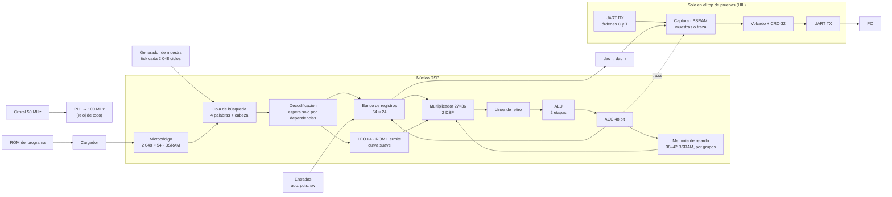

# Arquitectura del FPGA

Qué hay dentro de la FPGA, cómo se conecta y cómo ha cambiado fase a fase. Se actualiza al cerrar cada fase y en cada PR que cambie bloques del FPGA. La explicación sencilla de cada componente está en `SBOM.md`; los fallos que dieron forma al diseño, en `fails.md`.

Chip: **Gowin GW5A-LV25** (Tang Primer 25K): 23 040 LUT4, 56 bloques de BSRAM de 18 Kbit, 28 bloques DSP, 6 PLL.

## Vista general (Fase 06, requisito previo)

Todo corre en **un solo dominio de reloj de 100 MHz** (ADR 0005). La única excepción es el medidor de frecuencia de las pruebas, que cruza al dominio del cristal en código Gray.

## Bloques

| Bloque | Fichero | Recursos | Latencia |
|---|---|---|---|
| PLL 50 → 100 MHz | `rtl/primitivas/pll_100.v` | 1 PLLA | — |
| Generador de muestra | `rtl/comun/generador_muestra.v` | ~20 LUT | 1 tick / 2 048 ciclos |
| Secuenciador del núcleo | `rtl/nucleo/nucleo.v` | la mayor parte de la lógica | segmentado en orden (ADR 0014): 1 ciclo de decodificación y 1 o más de ejecución; solo espera la instrucción que lee el ACC o un registro recién escrito |
| Microcódigo | `bsram_pipe` 2 048 × 54 + un registro | 6 BSRAM | 4 ciclos; búsqueda continua en una cola de 4 palabras y una cabeza registrada; un `SKP` que salta la vacía (8 ciclos) |
| Banco de registros | dentro de `nucleo.v` | 64 × 24 en flip-flops + 8 candidatos + máscara de escritura | lectura en 2 niveles: candidatos con la cabeza de la cola, elección al decodificar; escritura en 2 etapas: máscara y dato, y después el registro; quien lo lee espera 3 ciclos tras un `WRAX` |
| Multiplicador | `rtl/primitivas/mult_27x36.v` (con `PREG`) + 1 registro | 2 DSP | 5 ciclos (`LAT`) |
| Línea de retiro | dentro de `nucleo.v` | 4 etapas × (código, un operando de 24 bit y pc) | el producto y su instrucción llegan juntos a la ALU; el ACC se escribe en el orden del programa |
| ALU | `rtl/nucleo/alu.v` | ~1 000 LUT y 300 ALU | 2 etapas; la segunda escribe el ACC (7 ciclos desde la ejecución) |
| Memoria de retardo | `rtl/nucleo/memoria_retardo.v` + `bsram_pipe` segmentada | 1 BSRAM por cada 1 024 palabras; ~1 700 flip-flops de copias | 9 ciclos (`LAT_MEM`), solo en `RDA`, `CHO` y `RDAA`. Región absoluta de 32 768 palabras en [P, P + 32 768) si el programa usa `RDAA` o `WRAA` |
| Copias de un registro | `rtl/primitivas/registro_copia.v` | flip-flops `DFF` con `keep` | 1 ciclo |
| LFO ×4 | `rtl/nucleo/lfo_banco.v` | ~380 LUT y 377 ALU | 26 ciclos por muestra |
| ROM Hermite | `rtl/nucleo/tabla_hermite.v` (generada) | ~820 LUT | combinacional + registro |
| Curva suave | `rtl/nucleo/curva_fin.v` | una resta y una saturación | registrada |
| UART TX / RX | `rtl/comun/uart_tx.v`, `uart_rx.v` | ~50 LUT cada una | 115 200 baudios |
| Cargador de programa | `rtl/comun/carga_programa.v` | ~30 LUT | instrucciones + 1 ciclos |
| Traza del núcleo (solo HIL) | `rtl/top/hil_nucleo.v`, orden `T` | ~150 flip-flops | graba (pc, ACC) en la captura |
| Programa del HIL | parámetro `PROGRAMA` de `hil_nucleo`; tops `hil_looper` y `hil_programa` | una ROM en lógica | plate por defecto; el looper prueba `RDAA` y `WRAA`; `hil_programa` lleva la ROM que escribe `sofifi rom` (`make hil HIL=NOMBRE`) |
| Controlador SD | `rtl/sd/sd_spi.v` | ~930 flip-flops y ~390 ALU con el cargador (yosys) | SPI modo 0: 400 kHz al arrancar y 12,5 MHz al leer; bloques de 512 bytes con CMD17; solo lee |
| Cargador del banco | `rtl/sd/cargador.v`, `rtl/sd/carga_sd.v` | (en la fila anterior) | dos pasadas: comprueba magia, límites, códigos y CRC-32 sin tocar el núcleo; después para el núcleo, escribe y vuelve a comprobar el CRC (Fase 08) |

## Presupuesto (top `hil_nucleo`, núcleo segmentado, ADR 0014)

| Recurso | Uso | Notas |
|---|---|---|
| LUT4 | 12 405 de 23 040 (54 %) | Según nextpnr, con las LUT de paso de los flip-flops. El núcleo solo (`nucleo_placa`): 11 709. |
| Flip-flops | 7 145 de 23 040 (31 %) | Unos 3 100 son copias y registros de segmentación (F-15); unos 450, la cola y el retiro. |
| ALU | 1 318 de 17 280 (8 %) | |
| BSRAM | 56 de 56 | 38 de retardo + 6 de microcódigo + 12 de captura. En el pedal final, la captura no existe: 42 + 6 = 48. |
| DSP | 2 de 28 | |
| Frecuencia | 110 MHz según nextpnr; **125 MHz en la placa sin errores (3 de 3) y 133,3 MHz (2 de 2)**; el looper, 125 MHz (2 de 2) | margen real de al menos un 25 % sobre 100 MHz (ADR 0011) |
| Ciclos por muestra | plate 783, hall 856, cloud 900, shimmer 1 030, sostenido 1 156, chorale 1 185; la cadena más cara, 1 270 de 2 048 | modelo de tiempos exacto en `model/sofifi/domain/coste.py` |

## Reglas de diseño que salen de los fallos

- **Ninguna salida de BSRAM va a lógica en el mismo ciclo.** Las memorias se hacen con `bsram_pipe`, que usa el registro de salida interno del bloque (F-11).
- **Ninguna aritmética de 50 bit encadenada en un ciclo.** La ALU va en dos etapas; las entradas del multiplicador salen de registros (F-10, F-11). La saturación mira los tres bits altos y no compara con constantes (ADR 0014).
- **Un array nuevo lleva su `ram_style`.** Yosys convierte en BSRAM cualquier array con lectura por índice, aunque sea pequeño (F-24).
- **Ningún registro alimenta bloques de todo el chip.** Las memorias grandes van segmentadas: copias de la dirección por grupo y por bloque, y salida registrada junto a cada bloque (F-15).
- **Ningún multiplexor ancho en un ciclo.** El banco de registros (64:1) va en dos niveles (F-15).
- **La escritura en el banco no se decodifica en el mismo ciclo.** Primero se registran una máscara de 64 bit y el dato; después se escribe (F-19).
- **Las señales que acompañan a una dirección registrada se registran con ella** (F-20).
- **Sumas en paralelo antes que en serie.** Si una corrección depende de un signo, se calculan todas las opciones y el signo elige (F-15).
- **Las ROM van en lógica**, con `rom_style` en el `case`, para no caer en BSRAM `SPX9` (F-09).
- **El timing se mide en la placa** (ADR 0011): nextpnr es optimista en un factor de 1,45 a 1,5 en el GW5A. Para el 20 % de margen hace falta que nextpnr dé unos 150 MHz o más, y medirlo. Si falla, `margen_reloj.py --traza` dice qué instrucción.

## Historia por fase

### Fase 02 · Primer bitstream

UART TX y un contador. Sin PLL, a 50 MHz. 207 LUT4 tras la primera segunda vuelta (F-07).

### Fase 03 · Primitivas

Se añaden los envoltorios del PLL (`pll_100`), del DSP (`mult_27x18`) y de la BSRAM inferida (`bsram_dp`), verificados en la placa (MED-06 a MED-08).

### Fase 04 · Núcleo DSP en RTL

- Secuenciador multiciclo: decodificación, ejecución con espera común y una latencia `LAT = 3`.
- Un solo multiplicador 27×36 para todo (24×18 y 24×24).
- Memoria de retardo de 42 bloques, LFO, ROM Hermite generada desde el modelo.
- Igual al modelo en 63 477 muestras (simulación). nextpnr: 140 MHz.

### Fase 05 · Núcleo verificado en la placa

- **Borrado de la memoria de retardo** al salir del reset, para empezar como el modelo.
- **UART RX** y top `hil_nucleo`: captura a velocidad real, volcado con CRC-32 a petición del PC.
- **Segmentación para el silicio** (F-11):
  - `LAT` pasa de 3 a 5;
  - BSRAM con registro de salida (`bsram_bloque`, `bsram_pipe`);
  - ALU en dos etapas;
  - la dirección del `CHO`, en tres pasos.
- El plate coincide bit a bit con el modelo **en el silicio** a 100 MHz.
- Coste: unos 13 ciclos por instrucción, frente a unos 6 en la Fase 04.

### Fase 06 · Requisito previo: lectura adelantada y margen del 20 %

- **Lectura adelantada:** al decodificar una instrucción se pide la siguiente al microcódigo. Si no hay salto, ya está leída cuando hace falta.
- **Segmentación para el silicio** (F-15):
  - memoria de retardo segmentada en grupos de 8 bloques, con copias locales de la dirección (`registro_copia`) y salidas registradas; la lectura tarda 9 ciclos (`LAT_MEM`);
  - banco de registros en dos niveles;
  - dirección física con tres sumas en paralelo;
  - `PREG` dentro del DSP.
- **Traza del núcleo en la placa:** el top HIL graba (pc, ACC) y el PC dice qué instrucción falla primero.
- Margen medido: **120 MHz sin errores**, frente a 106 MHz en la Fase 05.
- Ciclos por muestra: shimmer 1 514 (antes 1 601). La lectura adelantada ahorra unos 150 ciclos y la memoria segmentada gasta unos 65.

### Fase 06 · Biblioteca de programas (el RTL no cambia)

- Seis programas nuevos, iguales al modelo en la simulación: hall, cloud, reverse, lofi y swell en 4 883 muestras; cinta en 12 000, para llegar a su primer eco.
- **Cuantizar sin AND:** el lo-fi escala la muestra hacia abajo y la redondea al escribirla en un registro (`WRAX`). Después la vuelve a escalar con `SOF`.
- **Retardo variable sin instrucción nueva:** la cinta para un LFO senoidal en un cuarto de vuelta. Su forma vale 1 y el retardo del `CHO` sigue a `lfo0_depth`, que escribe el programa.
- **Coste de cada instrucción en el RTL**, medido en simulación y copiado al modelo (`coste.py`):

| Instrucción | Ciclos |
|---|---|
| `NOP`, `LDAX`, `CLR`, `ABSA`; `SKP` que no salta | 6 |
| `SKP` que salta | 8 |
| `RDAX`, `WRAX`, `WRA`, `WRAP`, `MAXX`, `MULX`, `SOF` | 10 |
| `RDFX` | 11 |
| `CLIP` | 14 |
| `RDA` | 19 |
| `CHO` (con `na`: 57) | 52 |
| Fijos por muestra (cota) | 34 |

- Un programa cabe si la suma es de 2 048 o menos. `sofifi asm` la da y `programas_test.py` la exige.
- **El cloud usa 42 814 palabras: no cabe en `hil_nucleo`**, que tiene 38 bloques de retardo para dejar sitio a la captura. Para probarlo en la placa hace falta reducir la captura.

### Fase 07 · RDAA y WRAA (región absoluta)

- **Dos instrucciones nuevas** (ADR 0009, actualización 2026-10-07): `RDAA` lee con interpolación lineal y `WRAA` escribe en una región de 32 768 palabras sin puntero. El registro R da la posición.
- **Región absoluta:** detrás de la memoria circular, en [P, P + 32 768). La dirección física es una suma (P + i), en paralelo con la de la memoria circular. El reset también la borra.
- **Predecodificación:** con 18 instrucciones, decidir en `E_EJEC` desde el `op` de 6 bit alargaba el control. `E_DECO` deja en registros la clase de la instrucción y unas banderas.
- **`tick` registrado** a la entrada del núcleo, con las entradas capturadas en el mismo flanco.
- **Escritura del banco en dos etapas** y resta de `RDAA` registrada (F-19). Margen medido: **125 MHz sin errores**, frente a 120 MHz en la Fase 06.

| Instrucción | Ciclos |
|---|---|
| `WRAA` | 10 |
| `RDAA` (dos lecturas, la diferencia por la fracción y el producto por C) | 27 |

- **Looper en la placa** (top `hil_looper`): el estímulo del HIL pulsa el footswitch para grabar y para hacer un overdub. El looper coincide bit a bit con el modelo de 100 a 125 MHz. Es la primera prueba de `RDAA` y `WRAA` en el silicio.
- **Todo el catálogo en la placa** (top `hil_programa`, `make hil HIL=NOMBRE`): 41 programas y 9 cadenas dan los mismos bits que el modelo (MED-16). Son todos los que caben en los 38 bloques de `hil_nucleo`. El que más gasta es `chorale`, con 1 935 ciclos de 2 048.

### Después de la Fase 07 · Núcleo segmentado en orden (ADR 0014)

- **Retiro desacoplado:** la instrucción deja su producto en una línea de retiro y el secuenciador pasa a la siguiente. El ACC se escribe en el orden del programa.
- **Esperas solo por dependencias:** la instrucción que lee el ACC espera a que el retiro se vacíe; la que lee el banco, 3 ciclos tras un `WRAX`.
- **Cola de búsqueda:** el microcódigo se pide sin parar; una cola de 4 palabras y una cabeza registrada dan la siguiente instrucción.
- **Modelo de tiempos exacto:** `coste.py` reproduce el secuenciador; la simulación exige los mismos ciclos que el RTL.
- **Timing:** la primera versión fallaba a 125 MHz en el silicio. La traza señaló el bucle del ACC: un reenvío delante de la suma y la saturación con dos comparaciones de 50 bit. Sin reenvío y con la saturación por los bits altos: 125 MHz (3 de 3) y 133,3 MHz (2 de 2).

| Instrucción | Ciclos (multiciclo) | Ciclos (segmentado), sin dependencia |
|---|---|---|
| `RDAX`, `WRAX`, `WRA`, `WRAP`, `SOF`, `MULX`, `MAXX` | 10 | 2 |
| `RDA` | 19 | 11 |
| `CHO` (LFO SIN) | 52 | 44 |
| `RDAA` | 27 | 19 |

Una instrucción que lee el ACC espera 7 ciclos desde el final de la anterior que lo escribe. En media, los programas gastan 1,6 veces menos ciclos. Las parejas en serie que caben pasan de 790 a 1 312 de 2 550 (con los registros compartidos, ADR 0013).

### Próximo cambio previsto

**Medida 2026-10-08: dos o tres núcleos no caben** (ADR 0013). Con 2 núcleos, yosys da 13 112 LUT4 y 9 928 flip-flops antes de colocar, y nextpnr no encuentra una colocación legal, ni con la BSRAM al 78 %. Con 3, 19 046 LUT4. Dos efectos a la vez se hacen con cadenas: un programa compuesto, sin cambiar el RTL. La persona propietaria confirmó seguir sin segundo núcleo.

El núcleo ya solo espera por dependencias (ADR 0014). La siguiente palanca de ciclos sería leer la memoria antes de su turno o bajar `LAT` a 3 (ADR 0014, opciones 3 y 4). Hoy limita más la memoria: es trabajo de la SDRAM.
