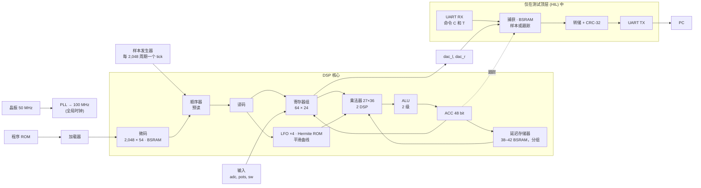

<!-- i18n: fuente=docs/arquitectura_fpga.md sha=f7e2bc47c175 estado=al_dia -->
# FPGA 架构

本文说明 FPGA 内部有什么、各部分如何连接，以及设计在各阶段如何变化。每个阶段结束时更新本文；每个改动 FPGA 模块的 PR 也要更新本文。各组件的简明说明见 `SBOM.zh-CN.md`；塑造了设计的故障见 `fails.zh-CN.md`。

芯片：**Gowin GW5A-LV25**（Tang Primer 25K）：23,040 个 LUT4，56 个 18 Kbit 的 BSRAM 块，28 个 DSP 块，6 个 PLL。

## 总览（第 06 阶段，前置条件）

所有逻辑都运行在**单一的 100 MHz 时钟域**中（ADR 0005（西班牙语））。唯一的例外是测试用的频率计：它以格雷码跨入晶振时钟域。

## 模块

| 模块 | 文件 | 资源 | 延迟 |
|---|---|---|---|
| PLL 50 → 100 MHz | `rtl/primitivas/pll_100.v` | 1 个 PLLA | — |
| 样本发生器 | `rtl/comun/generador_muestra.v` | ~20 LUT | 1 个 tick / 2,048 周期 |
| 核心顺序器 | `rtl/nucleo/nucleo.v` | 大部分逻辑 | 每条指令约 14 个周期；执行当前指令时读取下一条；`E_DECO` 把指令的类别存入一个寄存器 |
| 微码 | `bsram_pipe` 2,048 × 54 + 一个寄存器 | 6 BSRAM | 4 个周期；无跳转时已经读出 |
| 寄存器组 | 在 `nucleo.v` 内 | 64 × 24 触发器 + 8 个候选 + 写掩码 | 读取分 2 级：在 `E_LEER` 取候选，在 `E_DECO` 选择；写入分 2 级：先寄存掩码和数据，再写寄存器 |
| 乘法器 | `rtl/primitivas/mult_27x36.v`（带 `PREG`）+ 1 个寄存器 | 2 DSP | 5 个周期（`LAT`） |
| ALU | `rtl/nucleo/alu.v` | ~1,000 LUT 和 300 ALU | 2 级 + 写回 |
| 延迟存储器 | `rtl/nucleo/memoria_retardo.v` + 流水线化的 `bsram_pipe` | 每 1,024 字 1 个 BSRAM；~1,700 个副本触发器 | 9 个周期（`LAT_MEM`），仅用于 `RDA`、`CHO` 和 `RDAA`。如果程序使用 `RDAA` 或 `WRAA`，在 [P, P + 32,768) 有一个 32,768 字的绝对区域 |
| 寄存器副本 | `rtl/primitivas/registro_copia.v` | 带 `keep` 的 `DFF` 触发器 | 1 个周期 |
| LFO ×4 | `rtl/nucleo/lfo_banco.v` | ~380 LUT 和 377 ALU | 每个样本 26 个周期 |
| Hermite ROM | `rtl/nucleo/tabla_hermite.v`（生成） | ~820 LUT | 组合逻辑 + 寄存器 |
| 平滑曲线 | `rtl/nucleo/curva_fin.v` | 一次减法和一次饱和 | 寄存输出 |
| UART TX / RX | `rtl/comun/uart_tx.v`、`uart_rx.v` | 各 ~50 LUT | 115,200 波特 |
| 程序加载器 | `rtl/comun/carga_programa.v` | ~30 LUT | 指令数 + 1 个周期 |
| 核心跟踪（仅 HIL） | `rtl/top/hil_nucleo.v`，命令 `T` | ~150 个触发器 | 把 (pc, ACC) 记录到捕获中 |

## 预算（顶层 `hil_nucleo`，第 07 阶段，RDAA 和 WRAA）

| 资源 | 用量 | 说明 |
|---|---|---|
| LUT4 | 11,428 / 23,040（50 %） | nextpnr 的数值，包含触发器的直通 LUT。 |
| 触发器 | 6,705 / 23,040（29 %） | 约 3,100 个是副本和流水线寄存器（F-15）。 |
| ALU | 1,294 / 17,280（7 %） | 绝对区域的加法增加约 100 个（F-19）。 |
| BSRAM | 56 / 56 | 38 个用于延迟 + 6 个用于微码 + 12 个用于捕获。最终的踏板没有捕获：42 + 6 = 48。 |
| DSP | 2 / 28 | |
| 频率 | nextpnr 给出 144 MHz；**开发板上 125 MHz 无错误（3 次中 3 次）**；133.3 MHz，1 次中 1 次 | 相对 100 MHz 的实际余量至少为 25 %（F-19，ADR 0011（西班牙语）） |
| 每个样本的周期数 | reverse 431、lofi 620、cinta 658、plate 1,195、freeze 1,313、cloud 1,356、swell 1,467、shimmer 1,514、hall 1,578，上限 2,048 | 每条指令的开销见 `model/sofifi/domain/coste.py` |

## 来自故障的设计规则

- **BSRAM 的输出不在同一周期进入逻辑。** 存储器用 `bsram_pipe` 实现，它使用块内部的输出寄存器（F-11）。
- **一个周期内不做链式 50 bit 运算。** ALU 分两级；乘法器的输入来自寄存器（F-10、F-11）。
- **没有寄存器驱动遍布全芯片的模块。** 大存储器采用流水线：每个组和每个块都有地址副本，每个块旁边都有寄存输出（F-15）。
- **一个周期内没有宽多路选择器。** 寄存器组（64:1）分两级（F-15）。
- **寄存器组的写入不在同一周期译码。** 先寄存一个 64 bit 掩码和数据，再写入（F-19）。
- **伴随寄存地址的信号要和地址一起寄存**（F-20）。
- **并行加法优先于串行加法。** 如果一个修正取决于符号，就先计算所有选项，再由符号选择（F-15）。
- **ROM 放在逻辑中**，在 `case` 上加 `rom_style`，以免被映射为 BSRAM `SPX9`（F-09）。
- **时序在开发板上测量**（ADR 0011）：在 GW5A 上，nextpnr 乐观 1.45 到 1.5 倍。要有 20 % 的余量，nextpnr 需要给出约 150 MHz 或更高，并且要实测。如果失败，`margen_reloj.py --traza` 会指出是哪条指令。

## 各阶段历史

### 第 02 阶段 · 第一个比特流

UART TX 和一个计数器。没有 PLL，运行在 50 MHz。第一次“第二轮优化”后为 207 个 LUT4（F-07）。

### 第 03 阶段 · 原语

加入 PLL（`pll_100`）、DSP（`mult_27x18`）和推断式 BSRAM（`bsram_dp`）的封装，并在开发板上验证（MED-06 到 MED-08）。

### 第 04 阶段 · RTL 中的 DSP 核心

- 多周期顺序器：译码、带公共等待的执行、延迟 `LAT = 3`。
- 所有运算（24×18 和 24×24）只用一个 27×36 乘法器。
- 42 个块的延迟存储器、LFO、由模型生成的 Hermite ROM。
- 在 63,477 个样本上与模型一致（仿真）。nextpnr：140 MHz。

### 第 05 阶段 · 在开发板上验证的核心

- 复位结束后**清空延迟存储器**，以与模型相同的状态开始。
- **UART RX** 和顶层 `hil_nucleo`：以实际速度捕获，PC 请求时带 CRC-32 转储。
- **面向硅片的流水线化**（F-11）：
  - `LAT` 从 3 改为 5；
  - 带输出寄存器的 BSRAM（`bsram_bloque`、`bsram_pipe`）；
  - ALU 分两级；
  - `CHO` 的地址分三步计算。
- plate 程序在 100 MHz 下**在硅片上**与模型逐位一致。
- 开销：每条指令约 13 个周期，第 04 阶段约为 6 个。

### 第 06 阶段 · 前置条件：预读和 20 % 余量

- **预读：** 译码一条指令时，向微码请求下一条。如果没有跳转，需要时下一条已经读出。
- **面向硅片的流水线化**（F-15）：
  - 延迟存储器按 8 个块分组流水线化，带本地地址副本（`registro_copia`）和寄存输出；读取需要 9 个周期（`LAT_MEM`）；
  - 寄存器组分两级；
  - 物理地址用三个并行加法计算；
  - DSP 内部使用 `PREG`。
- **开发板上的核心跟踪：** HIL 顶层记录 (pc, ACC)，PC 指出最先出错的指令。
- 实测余量：**120 MHz 无错误**，第 05 阶段为 106 MHz。
- 每个样本的周期数：shimmer 1,514（之前 1,601）。预读节省约 150 个周期，分段存储器增加约 65 个。

### 第 06 阶段 · 程序库（RTL 不变）

- 六个新程序，在仿真中与模型一致：hall、cloud、reverse、lofi 和 swell 用 4,883 个样本；cinta 用 12,000 个，以到达它的第一个回声。
- **不用 AND 的量化：** lo-fi 程序把样本按比例缩小，在写入寄存器（`WRAX`）时舍入。之后用 `SOF` 再放大回去。
- **无需新指令的可变延迟：** cinta 程序让一个正弦 LFO 停在四分之一周处。此时其波形值为 1，`CHO` 的延迟跟随程序写入的 `lfo0_depth`。
- **RTL 中每条指令的开销**，在仿真中测得并复制到模型中（`coste.py`）：

| 指令 | 周期 |
|---|---|
| `NOP`、`LDAX`、`CLR`、`ABSA`；不跳转的 `SKP` | 6 |
| 跳转的 `SKP` | 8 |
| `RDAX`、`WRAX`、`WRA`、`WRAP`、`MAXX`、`MULX`、`SOF` | 10 |
| `RDFX` | 11 |
| `CLIP` | 14 |
| `RDA` | 19 |
| `CHO`（带 `na`：57） | 52 |
| 每个样本的固定开销（上界） | 34 |

- 总和不超过 2,048 时，程序可以装下。`sofifi asm` 给出总和，`programas_test.py` 强制要求这一点。
- **cloud 程序使用 42,814 个字：装不进 `hil_nucleo`**。该顶层只有 38 个延迟块，为捕获留出空间。要在开发板上测试 cloud，需要缩小捕获。

### 第 07 阶段 · RDAA 和 WRAA（绝对区域）

- **两条新指令**（ADR 0009，2026-10-07 更新）：`RDAA` 用线性插值读取，`WRAA` 写入。两者访问一个 32,768 字、没有指针的区域。寄存器 R 给出位置。
- **绝对区域：**位于循环存储器之后，在 [P, P + 32,768)。物理地址是一次加法（P + i），与循环存储器的地址并行计算。复位时也清除该区域。
- **预译码：**有 18 条指令时，在 `E_EJEC` 中根据 6 bit 的 `op` 做判断会拉长控制路径。`E_DECO` 把指令的类别和一些标志存入寄存器。
- **寄存的 `tick`**：在核心入口处寄存，输入在同一个时钟沿捕获。
- **寄存器组的写入分两级**，`RDAA` 的减法也寄存（F-19）。实测余量：**125 MHz 无错误**，第 06 阶段为 120 MHz。

| 指令 | 周期 |
|---|---|
| `WRAA` | 10 |
| `RDAA`（两次读取、差值乘以小数部分、再乘以 C） | 27 |

### 下一个计划中的改动

目前每条指令都等待自己的结果（约 14 个周期）。下一个改进点是：当下一条指令不使用 ACC，也不使用当前指令写入的寄存器时，就不等待。这需要检测指令之间的依赖。结果仍与模型一致。这个改动很大，将由一个 ADR 决定。
